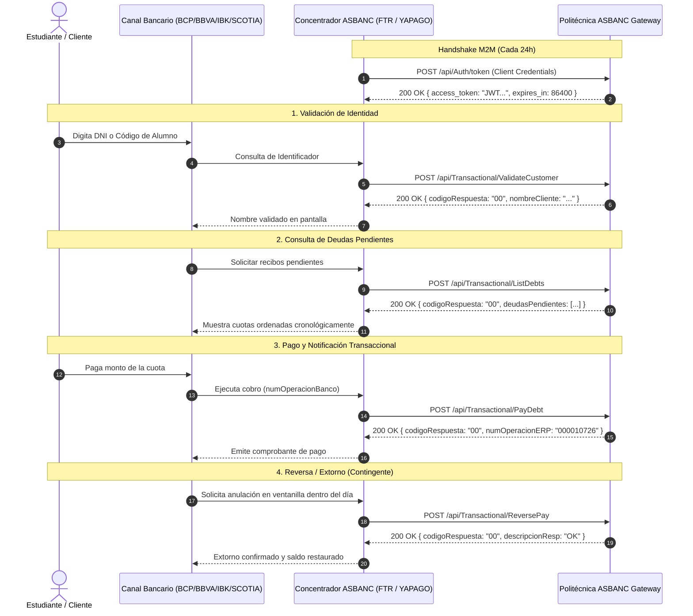

# 📑 Especificación de APIs REST - ASBANC FTR / YAPAGO V47

> **Documento Oficial de Referencia:** `Guía detallada de integración V47.pdf`  
> **Servicio:** Facilitador Transaccional de Recaudaciones (FTR) / YAPAGO  
> **Modelo de Integración:** APIs REST / JSON (Modalidad On-Host en Tiempo Real)  
> **SLA Bancario de Certificación:** Respuesta API < 3.0 segundos (Objetivo Interno: < 50 ms)  
> **Archivo:** `API.md`

---

## 🏛️ 1. Principios Generales del Modelo REST

De acuerdo con la **Sección 3.3 (Networking)**, **Sección 7 (Estructura Básica de los Métodos)**, **Sección 8 (Consideraciones Especiales)** y **Sección 11.5 (Ejemplos de Consumo)** de la Guía V47, el modelo de integración REST se rige bajo los siguientes estándares normativos:

1. **Método HTTP Único**: Todos los métodos de la API se invocan exclusivamente mediante **`POST`**.
2. **Código de Estado HTTP Estándar (200 OK)**:
   - Toda respuesta del servidor (éxito, validación de negocio, deuda no encontrada o excepción no controlada) **debe retornar siempre código HTTP `200 OK`**.
   - Los fallos o estados de negocio nunca se manejan con códigos HTTP 4xx o 5xx; se comunican mediante los atributos `codigoRespuesta` y `descripcionResp` dentro del cuerpo JSON.
3. **Seguridad y Cifrado de Transporte**:
   - Soporte obligatorio de **TLS 1.2 y 1.3** con cifrados seguros (*Ciphersuites* fuertes; deshabilitados 3DES, RC4 y `_CBC_SHA`).
   - Cifrado de transporte mínimo AES-256.
4. **Autenticación OAuth 2.0 / JWT**:
   - Token JWT (JSON Web Token) emitido por la pasarela mediante el servicio `POST /api/Auth/token` o acordado con cabecera `Authorization: Bearer <token>` o `Authorization: Basic <token>`.
   - Duración de validez del token:
     - **Internet (Directo)**: Máximo **24 horas**.
     - **VPN (Cliente Cloud / BANFAST)**: Máximo **14 días**.
     - **BANCARED (Cliente Premium)**: Máximo **90 días**.
5. **Formato de Tipos de Datos y Fechas**:
   - **`AN`**: Alfanumérico (letras sin tildes, sin letra `Ñ`, números, punto y guion medio según el campo).
   - **`N`**: Numérico entero positivo.
   - **`ND`**: Numérico decimal con dos decimales (`##########.##`).
   - **Fechas**: Formato `DDMMAAAA` (8 caracteres, sin guiones ni barras, ej. `21092026`).
   - **Horas**: Formato `HHMMSS` (6 caracteres, formato 24h, sin dos puntos, ej. `143000`).
   - **Moneda**: `"1"` = Soles (PEN), `"2"` = Dólares Americanos (USD).
6. **Reglas de Prelación y Orden de Deudas**:
   - Las deudas retornadas en `ListDebts` deben venir siempre ordenadas de forma **ascendente** (de la cuota/recibo más antiguo al más reciente).

---

## 🧭 2. Catálogo General de Métodos y Endpoints

| Método del Negocio | Nombre Canónico FTR | Endpoint REST Oficial | Obligatoriedad | SLA Máximo |
| :--- | :--- | :--- | :---: | :---: |
| **Autenticación M2M** | `ObtenerToken` | `POST /api/Auth/token` | Obligatorio (Pág. 8) | < 1.0s |
| **Validación de Identidad** | `ValidarCliente` | `POST /api/Transactional/ValidateCustomer` | Opcional / Recomendado (Pág. 18) | 0.5s – 1.0s |
| **Consulta de Recibos / Deudas** | `ConsultarDeuda` | `POST /api/Transactional/ListDebts` | Obligatorio (Pág. 18) | 0.5s – 1.25s |
| **Notificación y Pago** | `NotificarPago` | `POST /api/Transactional/PayDebt` | Obligatorio (Pág. 21) | 1.0s – 1.75s |
| **Reversa / Extorno de Pago** | `RevertirPago` | `POST /api/Transactional/ReversePay` | Obligatorio (Pág. 23) | 1.0s – 1.75s |



---

## 🔑 3. Servicio de Autenticación (OAuth 2.0 / JWT)

### `POST /api/Auth/token`
Servicio exigido en la **Sección 3.3 (Networking, Pág. 8)** para emitir tokens de autenticación Bearer JWT con algoritmo criptográfico seguro (HS256) antes de permitir el consumo de los endpoints transaccionales.

#### Cabeceras HTTP
```http
Content-Type: application/json
Accept: application/json
```

#### Payload de Entrada (Request JSON)
```json
{
  "grant_type": "client_credentials",
  "client_id": "asbanc_ftr",
  "client_secret": "asbanc_ftr_secret_2026"
}
```

#### Parámetros de Entrada
| Campo | Tipo | Longitud | Descripción |
| :--- | :---: | :---: | :--- |
| `grant_type` | `AN` | 20 | Tipo de concesión OAuth 2.0 (siempre `"client_credentials"`). |
| `client_id` | `AN` | 50 | Identificador del cliente asignado a ASBANC FTR. |
| `client_secret` | `AN` | 100 | Secreto compartido de autenticación. |

#### Respuesta Exitosa (`200 OK`)
```json
{
  "access_token": "eyJhbGciOiJIUzI1NiIsInR5cCI6IkpXVCJ9...",
  "token_type": "Bearer",
  "expires_in": 86400,
  "scope": "asbanc:transactional",
  "codigoRespuesta": "00",
  "descripcionResp": "TOKEN GENERADO EXITOSAMENTE"
}
```

---

## 👤 4. Método 1: Validación de Cliente (`ValidarCliente`)

### `POST /api/Transactional/ValidateCustomer`
Valida si el código de identificación ingresado por el usuario en el cajero, ventanilla o banca digital existe en el sistema institucional. En caso afirmativo, retorna el nombre completo o razón social.

* **Obligatoriedad:** Opcional / Recomendado (Pág. 18). Si la empresa no lo implementa, el método `ListDebts` debe asumir función mixta y devolver el nombre del cliente.

#### Cabeceras HTTP
```http
Authorization: Bearer <access_token>
Content-Type: application/json
Accept: application/json
```

#### Parámetros de Entrada (Request)
| # | Nombre | Tipo | Longitud | Formato | Descripción |
| :-: | :--- | :---: | :---: | :---: | :--- |
| 1 | `tipoConsulta` | `AN` | 1 | - | Criterio de búsqueda: `0`=Código Cliente/Alumno, `1`=DNI, `2`=RUC. |
| 2 | `idConsulta` | `AN` | 14 | - | Identificador del cliente (sin espacios ni caracteres especiales). |
| 3 | `codigoEmpresa` | `AN` | 3 | - | Código institucional asignado por ASBANC (ej. `"998"` o `"512"`). |
| 4 | `codigoProducto` | `AN` | 3 | - | Código del producto/servicio (por defecto `"001"`). |

#### Parámetros de Salida (Response)
| # | Nombre | Tipo | Longitud | Descripción |
| :-: | :--- | :---: | :---: | :--- |
| 1 | `codigoRespuesta` | `AN` | 2 | Código estándar ASBANC (`00`=OK, `16`=Cliente no existe, `99`=Error). |
| 2 | `descripcionResp` | `AN` | 200 | Mensaje descriptivo (`OK`, `CLIENTE NO EXISTE`, etc.). |
| 3 | `nombreCliente` | `AN` | 30 | Nombre del cliente (números, letras, espacio y punto; sin Ñ ni tildes). |

#### Ejemplos JSON

##### Caso 1: Cliente Existe (`00 OK`)
```json
// Petición
{
  "tipoConsulta": "1",
  "idConsulta": "74202604",
  "codigoEmpresa": "998",
  "codigoProducto": "001"
}

// Respuesta (200 OK)
{
  "codigoRespuesta": "00",
  "descripcionResp": "OK",
  "nombreCliente": "MARTHA ORTEGA RIOS"
}
```

##### Caso 2: Cliente No Existe (`16`)
```json
// Petición
{
  "tipoConsulta": "1",
  "idConsulta": "00000000",
  "codigoEmpresa": "998",
  "codigoProducto": "001"
}

// Respuesta (200 OK)
{
  "codigoRespuesta": "16",
  "descripcionResp": "CLIENTE NO EXISTE",
  "nombreCliente": ""
}
```

---

## 💳 5. Método 2: Consulta de Recibos / Deudas (`ConsultarDeuda`)

### `POST /api/Transactional/ListDebts`
Retorna las cuotas, pensiones o recibos pendientes de pago asociados al cliente.  
Las deudas **siempre deben anidarse dentro de un arreglo (`deudasPendientes`)** y ordenarse cronológicamente de la más antigua a la más reciente (Pág. 21-23).

* **Obligatoriedad:** Obligatorio.
* **Modalidades Soportadas:**
  - **Validación Completa**: Consulta cuotas exactas emitidas por la institución.
  - **Validación Parcial / Pago Libre**: Retorna documento comodín (ej. `PAGOLIBRE`) permitiendo abonos parciales mayores al importe mínimo.

#### Parámetros de Entrada (Request)
| # | Nombre | Tipo | Longitud | Formato | Descripción |
| :-: | :--- | :---: | :---: | :---: | :--- |
| 1 | `codigoProducto` | `AN` | 3 | - | Código del producto o servicio (default `"001"`). |
| 2 | `tipoConsulta` | `AN` | 1 | - | Criterio de búsqueda: `0`=Código Alumno, `1`=DNI, `2`=RUC. |
| 3 | `idConsulta` | `AN` | 14 | - | Identificador del cliente según el tipo de documento. |
| 4 | `codigoBanco` | `AN` | 4 | - | Código del banco recaudador (ej. `1020` BCP, `1022` Interbank). |
| 5 | `canalPago` | `AN` | 2 | - | Canal de pago (`10` Ventanilla, `20` ATM, `60` Web, `81` Yape, `82` Plin). |
| 6 | `codigoEmpresa` | `AN` | 3 | - | Código asignado por ASBANC (ej. `"998"`). |

#### Parámetros de Salida (Response)
| # | Nombre | Tipo | Longitud | Descripción |
| :-: | :--- | :---: | :---: | :--- |
| 1 | `codigoRespuesta` | `AN` | 2 | Código ASBANC (`00`=OK, `22`=Sin deudas pendientes, `16`=No existe, `99`=Error). |
| 2 | `descripcionResp` | `AN` | 200 | Mensaje descriptivo (`OK`, `CLIENTE SIN DEUDAS PENDIENTES`, etc.). |
| 3 | `deudasPendientes` | `Array` | 20 máx | Colección de deudas ordenadas de la más antigua a la más reciente. |

##### Atributos de Cada Elemento en `deudasPendientes`:
| Campo | Tipo | Longitud | Formato | Descripción |
| :--- | :---: | :---: | :---: | :--- |
| `codigoProducto` | `AN` | 3 | - | Código de producto o servicio (ej. `"001"`). |
| `numDocumento` | `AN` | 16 | - | Identificador único del recibo/cuota (alfanumérico y guion medio). |
| `descDocumento` | `AN` | 20 | - | Glosa de la deuda (ej. `"PENSION MARZO"`, `"CUOTA 1"`). |
| `fechaVencimiento`| `AN` | 8 | `DDMMAAAA` | Fecha límite de pago de la deuda. |
| `fechaEmision` | `AN` | 8 | `DDMMAAAA` | Fecha de emisión. Si no aplica, enviar igual a la de vencimiento. |
| `deuda` | `ND` | 12 (2 dec) | `##########.##` | Importe total exigible de la deuda (debe ser `>= 1.00`). |
| `pagoMinimo` | `ND` | 12 (2 dec) | `##########.##` | Monto mínimo a pagar. Si no hay pago parcial, es igual a `deuda`. |
| `monedaDoc` | `AN` | 1 | - | `"1"` = Soles, `"2"` = Dólares. |

#### Ejemplos JSON

##### Caso 1: Cliente con Deudas Pendientes (`00 OK`)
```json
// Petición
{
  "tipoConsulta": "0",
  "idConsulta": "26023353010012",
  "codigoEmpresa": "998",
  "codigoProducto": "001",
  "codigoBanco": "1020",
  "canalPago": "10"
}

// Respuesta (200 OK)
{
  "codigoRespuesta": "00",
  "descripcionResp": "OK",
  "deudasPendientes": [
    {
      "codigoProducto": "001",
      "numDocumento": "10726",
      "descDocumento": "CUOTAS - PENSIONES",
      "fechaVencimiento": "09032026",
      "fechaEmision": "05032026",
      "deuda": 833.33,
      "pagoMinimo": 833.33,
      "monedaDoc": "1"
    }
  ]
}
```

##### Caso 2: Cliente sin Deudas (`22`)
```json
{
  "codigoRespuesta": "22",
  "descripcionResp": "CLIENTE SIN DEUDAS PENDIENTES",
  "deudasPendientes": []
}
```

---

## 💰 6. Método 3: Notificación de Pago (`NotificarPago`)

### `POST /api/Transactional/PayDebt`
Método transaccional mediante el cual el banco notifica que el pago fue recibido satisfactoriamente en sus canales. El sistema institucional marca la deuda como pagada, genera el comprobante contable y emite el `numOperacionERP`.

* **Obligatoriedad:** Obligatorio (Pág. 23-25).
* **Control de Idempotencia Exigido**: Si el banco reintenta el pago debido a un timeout o corte de red con el mismo `numOperacionBanco` y `codigoBanco`, el sistema debe responder `codigoRespuesta: "00"` retornando el mismo `numOperacionERP` sin duplicar el cobro ni alterar saldos.

#### Parámetros de Entrada (Request)
| # | Nombre | Tipo | Longitud | Formato | Descripción |
| :-: | :--- | :---: | :---: | :---: | :--- |
| 1 | `fechaTxn` | `AN` | 8 | `DDMMAAAA` | Fecha en que se realizó la transacción en el banco. |
| 2 | `horaTxn` | `AN` | 6 | `HHMMSS` | Hora en que se realizó la transacción en el banco. |
| 3 | `canalPago` | `AN` | 2 | - | Canal de pago (`10`, `20`, `60`, `81`, `82`, etc.). |
| 4 | `codigoBanco` | `AN` | 4 | - | Código de banco recaudador (`1020`, `1022`, etc.). |
| 5 | `numOperacionBanco` | `AN` | 12 | - | Identificador único de operación emitido por el banco durante el día. |
| 6 | `formaPago` | `AN` | 2 | - | Forma de pago (`01` Efectivo, `02` Débito, `03` Crédito, `06` Cargo en Cuenta). |
| 7 | `tipoConsulta` | `AN` | 1 | - | Criterio de búsqueda (`0`, `1`, `2`). |
| 8 | `idConsulta` | `AN` | 14 | - | Identificador del cliente. |
| 9 | `codigoProducto` | `AN` | 3 | - | Código del producto o servicio (`"001"`). |
| 10 | `numDocumento` | `AN` | 16 | - | Número del documento/recibo cancelado. |
| 11 | `importePagado` | `ND` | 12 (2 dec) | `##########.##` | Importe pagado en la ventanilla/app bancaria. |
| 12 | `monedaDoc` | `AN` | 1 | - | `"1"` = Soles, `"2"` = Dólares. |
| 13 | `codigoEmpresa` | `AN` | 3 | - | Código asignado por ASBANC (ej. `"998"`). |

#### Parámetros de Salida (Response)
| # | Nombre | Tipo | Longitud | Descripción |
| :-: | :--- | :---: | :---: | :--- |
| 1 | `codigoRespuesta` | `AN` | 2 | Código ASBANC (`00`=OK, `21`=No cumple importe mínimo, `99`=Error). |
| 2 | `nombreCliente` | `AN` | 30 | Nombre completo del cliente. |
| 3 | `numOperacionERP` | `AN` | 9 | Número único generado en el ERP (numérico con ceros a la izquierda, ej. `"000010726"`). |
| 4 | `descripcionResp` | `AN` | 200 | Mensaje descriptivo (`OK`, `PAGO PREVIAMENTE REGISTRADO (IDEMPOTENTE)`, etc.). |

#### Ejemplos JSON

##### Caso 1: Pago Conforme (`00 OK`)
```json
// Petición
{
  "fechaTxn": "21092026",
  "horaTxn": "113000",
  "canalPago": "10",
  "codigoBanco": "1020",
  "numOperacionBanco": "A05478452120",
  "formaPago": "01",
  "tipoConsulta": "0",
  "idConsulta": "26023353010012",
  "codigoProducto": "001",
  "numDocumento": "10726",
  "importePagado": 833.33,
  "monedaDoc": "1",
  "codigoEmpresa": "998"
}

// Respuesta (200 OK)
{
  "codigoRespuesta": "00",
  "nombreCliente": "MARTHA ORTEGA RIOS",
  "numOperacionERP": "000010726",
  "descripcionResp": "OK"
}
```

##### Caso 2: Error de Importe Mínimo (`21`)
```json
{
  "codigoRespuesta": "21",
  "nombreCliente": "",
  "numOperacionERP": "",
  "descripcionResp": "NO CUMPLE IMPORTE MINIMO"
}
```

---

## 🔄 7. Método 4: Reversa / Extorno de Pago (`RevertirPago`)

### `POST /api/Transactional/ReversePay`
Método transaccional mediante el cual el banco solicita anular (Rollback) un pago realizado previamente dentro de la misma jornada operativa.  
La deuda debe volver a su estado **Pendiente de Pago** de forma inmediata, de tal manera que una consulta posterior con `ListDebts` vuelva a mostrar la cuota (Pág. 25-27).

* **Obligatoriedad:** Obligatorio.
* **Comportamiento por Banco**:
  - **BCP y BBVA**: Extorno directo dentro del día.
  - **Scotiabank e Interbank**: Contemplan adicionalmente el "Extorno de Anulación" (reversión de una anulación reenviando los parámetros del pago original).

#### Parámetros de Entrada (Request)
| # | Nombre | Tipo | Longitud | Formato | Descripción |
| :-: | :--- | :---: | :---: | :---: | :--- |
| 1 | `fechaTxn` | `AN` | 8 | `DDMMAAAA` | Fecha en que se realiza el extorno en el banco. |
| 2 | `horaTxn` | `AN` | 6 | `HHMMSS` | Hora en que se realiza el extorno en el banco. |
| 3 | `codigoBanco` | `AN` | 4 | - | Código del banco solicitante. |
| 4 | `numOperacionBanco` | `AN` | 12 | - | Número de operación bancaria del pago original que se desea anular. |
| 5 | `tipoConsulta` | `AN` | 1 | - | Criterio de búsqueda (`0`, `1`, `2`). |
| 6 | `idConsulta` | `AN` | 14 | - | Identificador del cliente. |
| 7 | `numDocumento` | `AN` | 16 | - | Número del documento de la deuda a extornar. |
| 8 | `codigoEmpresa` | `AN` | 3 | - | Código institucional asignado por ASBANC (ej. `"998"`). |

#### Parámetros de Salida (Response)
| # | Nombre | Tipo | Longitud | Descripción |
| :-: | :--- | :---: | :---: | :--- |
| 1 | `codigoRespuesta` | `AN` | 2 | Código ASBANC (`00`=Extorno OK, `68`=Txn a anular no existe, `72`=Tiempo excedido, `99`=Error). |
| 2 | `nombreCliente` | `AN` | 30 | Nombre del cliente. |
| 3 | `numOperacionERP` | `AN` | 9 | Número único de la operación de anulación en el ERP. |
| 4 | `descripcionResp` | `AN` | 200 | Mensaje descriptivo (`OK`, etc.). |

#### Ejemplos JSON

##### Caso 1: Extorno Conforme (`00 OK`)
```json
// Petición
{
  "fechaTxn": "21092026",
  "horaTxn": "113500",
  "codigoBanco": "1020",
  "numOperacionBanco": "A05478452120",
  "tipoConsulta": "0",
  "idConsulta": "26023353010012",
  "numDocumento": "10726",
  "codigoEmpresa": "998"
}

// Respuesta (200 OK)
{
  "codigoRespuesta": "00",
  "nombreCliente": "MARTHA ORTEGA RIOS",
  "numOperacionERP": "000010726",
  "descripcionResp": "OK"
}
```

##### Caso 2: Operación a Anular No Existe (`68`)
```json
{
  "codigoRespuesta": "68",
  "nombreCliente": "",
  "numOperacionERP": "",
  "descripcionResp": "TXN ORIG. A ANULAR NO EXISTE"
}
```

---

## 📊 8. Tablas Maestras y Catálogos Oficiales (Sección 11.2)

### 8.1 Códigos de Respuesta Estándar (`codigoRespuesta`)
| Código | Descripción Oficial ASBANC | Escenarios Típicos |
| :---: | :--- | :--- |
| **`00`** | **TRANSACCION PROCESADA OK** | Transacción conforme en validación, consulta, pago o reversa. |
| **`05`** | FUERA DE HORARIO DE ATENCION | Operación fuera de la ventana pactada. |
| **`13`** | AFIL. EMPR.-SERVICIO NO EXISTE | Empresa o servicio no configurado. |
| **`14`** | AFIL. EMPR.-SERVICIO NO ACTIVO | Servicio inactivo temporalmente. |
| **`16`** | **CLIENTE NO EXISTE** | DNI, RUC o código de alumno no registrado en la institución. |
| **`19`** | CUOTA PAGADA NO EXISTE | El documento enviado en el pago no existe. |
| **`20`** | CUOTA PAGADA YA CANCELADA | La cuota ya fue pagada previamente por otro canal. |
| **`21`** | **NO CUMPLE IMPORTE MINIMO** | Pago menor al mínimo permitido en cobranza parcial/libre. |
| **`22`** | **CLIENTE SIN DEUDA PENDIENTE** | Cliente existe pero no tiene recibos/cuotas por pagar. |
| **`23`** | NO PROCEDE X IND. EMPRESA | Regla de negocio particular de la empresa. |
| **`25`** | MONTO DE PAGO INVALIDO | Monto menor o igual a cero o con formato corrupto. |
| **`68`** | **TXN ORIG. A ANULAR NO EXISTE** | En `ReversePay`, cuando la operación original no fue encontrada. |
| **`70`** | IMP. PAGADO MENOR PAGO TOTAL | Cobro parcial no permitido en servicios de pago estricto. |
| **`71`** | TRACE DUPLICADO X FECHA/CANAL | Número de trace repetido. |
| **`72`** | TIEMPO EXTORNO/ANULA. EXCEDIDO | Intento de reversa fuera de la ventana horaria o de día. |
| **`74`** | EL PAGO DEBE SER TOTAL | No se admite fraccionamiento de la cuota. |
| **`75`** | PAGAR ANTES CTAS. ANTERIORES | Violación de la regla de prelación financiera. |
| **`81`** | MONEDA DE PAGO INVALIDO | Moneda diferente a Soles (1) o Dólares (2). |
| **`82`** | CODIGO DE BANCO INVALIDO | Código de banco no homologado. |
| **`99`** | **ERROR DESCONOCIDO** | Excepción de base de datos o fallo interno no mapeado. |

---

### 8.2 Entidades Financieras (`codigoBanco`) y Tiempos Máximos
| Código | Entidad Financiera / Banco | Modalidad Transaccional | Timeout Máximo Banco |
| :---: | :--- | :--- | :---: |
| **`1020`** | **Banco de Crédito del Perú (BCP)** | Notificación directa (asume procesado en timeout) | **3.5 segundos** |
| **`1021`** | **BanBif** | Confirmación total | **12.5 segundos** |
| **`1022`** | **Interbank** | Confirmación total (lanza reversa en timeout) | **10.5 segundos** |
| **`1023`** | **BBVA Continental** | Confirmación parcial (máx 3s de espera) | **3.5 segundos** |
| **`1024`** | **Scotiabank** | Confirmación total (lanza reversa en timeout) | **6.5 segundos** |
| **`1026`** | **Banco de Comercio** | Confirmación total | **6.5 segundos** |

> ⚠️ **SLA de Certificación YAPAGO**: A pesar de los tiempos propios de cada banco, **el tiempo máximo exigido en la certificación oficial YAPAGO para la API de la empresa es de < 3.0 segundos**.

---

### 8.3 Canales de Recaudación (`canalPago`)
| Código | Canal de Pago | Código | Canal de Pago |
| :---: | :--- | :---: | :--- |
| **`10`** | Ventanilla | **60`** | Internet Banking (Banca por Internet) |
| **`14`** | POS (Exclusivo Scotiabank) | **70`** | IVR (Respuesta de Voz Interactiva) |
| **`20`** | ATM (Cajero Automático) | **80`** | Banca Celular / App Móvil |
| **`30`** | Monederos Electrónicos | **81`** | **Yape** |
| **`40`** | Agente Corresponsal | **82`** | **Plin** |
| **`50`** | Kiosko Multimedia | **99`** | Otros Canales |

---

### 8.4 Criterios de Búsqueda (`tipoConsulta`)
| Código | Criterio de Búsqueda | Ejemplos de Identificador (`idConsulta`) |
| :---: | :--- | :--- |
| **`0`** | Código institucional / Alumno / Cliente / Suministro | `26023353010012`, `ALU-8845`, Carné Extranjería |
| **`1`** | Documento Nacional de Identidad (DNI) | `74202604`, `10000001` (8 dígitos numéricos) |
| **`2`** | Registro Único de Contribuyentes (RUC) | `20100055441` (11 dígitos numéricos) |

---

### 8.5 Formas de Pago (`formaPago`)
| Código | Forma de Pago | Código | Forma de Pago |
| :---: | :--- | :---: | :--- |
| **`01`** | **Efectivo** | **05`** | Tarjeta Virtual |
| **`02`** | **Tarjeta de Débito** | **06`** | **Cargo en Cuenta** |
| **`03`** | **Tarjeta de Crédito** | **07`** | Cargo en Cuenta y Efectivo (Mixto) |
| **`04`** | Cheque Mismo Banco | **08`** | Cheque de Otro Banco |

---

## 🛠️ 9. Herramientas de Prueba y Archivos de Ejecución

Para realizar pruebas paso a paso o automatizadas de esta especificación en el entorno local o de certificación:

1. **Guía Interactiva Paso a Paso:**
   - 📁 [`TESTAPI.http`](file:///home/mateo/projects/politecnica-asbanc/TESTAPI.http): Suite secuencial lista para ejecutar desde WebStorm, IntelliJ IDEA o VS Code REST Client con encadenamiento de variables y asserts automáticos.
2. **Suite General de Peticiones y Auditoría:**
   - 📁 [`asbanc-api.http`](file:///home/mateo/projects/politecnica-asbanc/asbanc-api.http): Catálogo de peticiones de validación, pagos, reversas y exportación de auditoría forense (`/api/Audit`).
3. **Batería de Pruebas Unitarias y de Integración Automatizadas:**
   - `npm test`: Ejecuta 96 pruebas automatizadas en Vitest con 100% de éxito.
   - `npm run test:batch-5`: Benchmark de 5 transacciones completas contra la base de datos real.
4. **Visores de Auditoría y Telemetría en Tiempo Real:**
   - `npm run audit [N]`: Muestra en consola las últimas `N` transacciones con sus payloads y latencias.
   - `npm run metrics`: Inspecciona los contadores Prometheus y latencias en `/metrics`.
