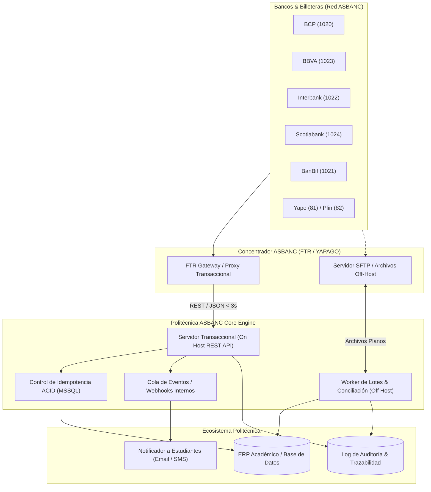

# 🧠 MEMORIA DE PROYECTO: POLITÉCNICA ASBANC (FTR / YAPAGO)

> **Documento Vivo de Arquitectura, Diseño, Componentes, Bitácora y Registro de Cambios**  
> **Ubicación:** `PROJECT_MEMORY.md`  
> **Estado:** Activo / En Mantenimiento Continuo  
> **Última Actualización:** 2026-09-21  
> **Versión del Proyecto:** 1.0.0  
> **Especificación Base:** ASBANC FTR (Facilitador Transaccional de Recaudaciones) / YAPAGO V46-V47  

---

## 📋 1. Ficha Técnica y Resumen Ejecutivo

| Parámetro | Detalle |
| :--- | :--- |
| **Nombre del Proyecto** | Politécnica ASBANC (`politecnica-asbanc`) |
| **Organización / Cliente** | Instituto de Formación Bancaria / Politécnica (`politecnica.edu.pe`) - ASBANC |
| **Propósito General** | Pasarela y suite de servicios de recaudación bancaria en línea y conciliación por lotes integrada a la red **ASBANC FTR / YAPAGO**, permitiendo a los estudiantes y clientes pagar pensiones, matrículas y derechos académicos en tiempo real desde la banca peruana (BCP, BBVA, Interbank, Scotiabank, BanBif, Yape, Plin). |
| **Ruta del Repositorio** | `/home/mateo/projects/politecnica-asbanc` |
| **Normativa / Especificación** | `Guía detallada de integración V47.pdf` (YAPAGO / ASBANC FTR V46-V47) |
| **Entorno de Ejecución** | Linux x86_64, Node.js 20+ (LTS), TypeScript 5.x, Fastify, Microsoft SQL Server 2019/2022 (`mssql`), Pino, Prometheus (`prom-client`) |
| **SLA de Rendimiento** | Respuesta API < 3.0 segundos (Certificación ASBANC YAPAGO); Objetivo Interno < 30 ms |
| **Nivel de Criticidad** | Crítico (Transacciones financieras, recaudación bancaria, conciliación de pagos) |
| **Archivo Fuente de Verdad** | `PROJECT_MEMORY.md` |

---

## 🎯 2. Visión, Objetivos y Alcance

### 2.1 Visión del Proyecto
Construir una pasarela de recaudación institucional de alta disponibilidad, segura y desacoplada que conecte el ERP/Core Académico de **Politécnica** con el concentrador **ASBANC FTR (YAPAGO)**, asegurando procesamiento de transacciones con latencia ultrabaja, conciliación automática, soporte de contingencia y auditoría forense inmutable.

### 2.2 Objetivos Técnicos y de Negocio
- **Cumplimiento Estricto de SLAs**: Procesamiento de transacciones bancarias en menos de 3 segundos para cumplir los tiempos de respuesta de BCP (3.5s), BBVA (3.5s), Scotiabank (6.5s) e Interbank (10.5s).
- **Operación Multimodal**:
  1. **ON HOST**: Comunicación transaccional REST/JSON síncrona en tiempo real.
  2. **OFF HOST**: Generación y consumo de archivos planos estructurados para recaudación diferida y conciliación diaria.
  3. **STAND IN**: Mecanismo híbrido de conmutación ante caídas del enlace On Host.
- **Seguridad Bancaria**: Cifrado TLS 1.2+, autenticación mediante cabeceras autorizadas, validación estricta de payloads, whitelisting de IPs y prevención de ataques de repetición.
- **Idempotencia Transaccional**: Garantía de cero cobros duplicados mediante el control estricto de identificadores únicos de operación bancaria (`numOperacionBanco`).

---

## 🏛️ 3. Arquitectura del Sistema

### 3.1 Diagrama de Arquitectura Global (On-Host & Off-Host)


### 3.2 Modalidades de Operación (ASBANC FTR)
1. **Modalidad ON HOST (En Línea / Tiempo Real)**:
   - Los bancos consultan directamente al API de Politécnica en el momento exacto en que el estudiante o cliente consulta en la ventanilla, cajero o app bancaria.
   - El sistema de Politécnica autoriza el pago en tiempo real y devuelve el comprobante/número de operación ERP.
2. **Modalidad OFF HOST (Archivos Planos por Lotes)**:
   - Politécnica genera periódicamente un archivo estructurado con el padrón de deudas emitidas.
   - YAPAGO procesa las deudas en su base local y genera un archivo consolidado de pagos realizados para su descarga y conciliación contable por parte de Politécnica.
3. **Modalidad STAND IN (Contingencia Híbrida)**:
   - Si el enlace ON HOST falla o se agota el tiempo de espera (timeout), YAPAGO conmuta a su base de datos de contingencia para no interrumpir el cobro al usuario final.

### 3.3 Estrategia de Replicación y Alta Disponibilidad en Producción (HA/DR)

Para cumplir con el nivel de servicio financiero exigido por ASBANC (cero tolerancia a pérdida de transacciones y failover transparente < 5 segundos), la base de datos **Microsoft SQL Server** se estructura en las siguientes capas de replicación y control transaccional ACID:

```mermaid
flowchart TD
    subgraph AppLayer ["Capa de Microservicios (Node.js Fastify)"]
        APP1["Fastify Instancia 1 (Activo)"]
        APP2["Fastify Instancia 2 (Activo)"]
    end

    subgraph MSSQL_HA ["Microsoft SQL Server - Always On Availability Group"]
        AG_LISTENER["AG Listener Virtual IP / DNS (puerto 1433)"]
        SQL_PRIM["Nodo 1: Primario (Read/Write)\nBase: politecnica_asbanc\nIdempotencia ACID & UQ_Txn_Banco_Op"]
        SQL_SEC_SYNC["Nodo 2: Secundario Síncrono (Read-Only)\nFailover Automático (RPO=0, RTO < 5s)"]
        SQL_SEC_ASYNC["Nodo 3: Réplica Asíncrona (DR / Sitio Alterno)\nRecuperación ante Desastres"]
    end

    subgraph ERP_Core ["Integración con Core / ERP Académico"]
        ERP_DB[("BD Central ERP Politécnica")]
        REPL["Replicación Transaccional MSSQL / CDC / Kafka"]
    end

    APP1 & APP2 -->|Transacciones RW & Locks ACID| AG_LISTENER

    AG_LISTENER --> SQL_PRIM
    SQL_PRIM ===|Commit Síncrono (Cero Pérdida)| SQL_SEC_SYNC
    SQL_PRIM -.->|Commit Asíncrono| SQL_SEC_ASYNC

    ERP_DB <==>|Sincronización Deudas / Pagos| REPL
    REPL <==> SQL_PRIM
```

1. **Alta Disponibilidad Transaccional (Always On Availability Groups - AG)**:
   - **Nodo Primario (Read/Write)**: Procesa las validaciones, pagos y extornos de ASBANC FTR.
   - **Nodo Secundario Síncrono (Read-Only)**: Replica cada transacción a nivel de registro de log (`.trn`) con confirmación síncrona (**RPO = 0**, cero transacciones perdidas) y failover automático en menos de 5 segundos (**RTO < 5s**).
   - **AG Listener (DNS Único)**: La aplicación Node.js se conecta al Listener (`DB_SERVER=ag-listener.politecnica.local`). Si el nodo 1 falla, el clúster conmuta automáticamente al nodo 2 sin reiniciar el backend.
   - **Read-Scale Out**: El endpoint masivo de descarga de auditoría (`/api/Audit/export`) puede rutearse a la réplica de solo lectura para evitar contención con los cajeros en vivo.
2. **Replicación con el ERP Institucional**:
   - **Replicación Transaccional de MSSQL**: El ERP publica las tablas maestras de `Clientes` y `Deudas` hacia la base `politecnica_asbanc` en tiempo real.
   - **Sincronización Inversa de Pagos**: Cada registro insertado en `TransaccionesBancarias` notifica al ERP mediante triggers transaccionales, colas de eventos (RabbitMQ/Kafka) o Change Data Capture (CDC).
3. **Recuperación ante Desastres (DR - Disaster Recovery)**:
   - Réplica secundaria asíncrona en un segundo centro de datos o nube (con RPO < 1s).
   - Respaldos continuos de Transaction Log cada 15 minutos y Full Backup diario.
4. **Idempotencia Transaccional Nativa (ACID sin Dependencia de Redis)**:
   - Prevención estricta de doble cobro y ataques de repetición garantizada a nivel de motor de base de datos relacional mediante `sp_Asbanc_PayDebt` bajo `BEGIN TRANSACTION` con aislamiento `SERIALIZABLE`.
   - Restricción única `UQ_Txn_Banco_Op (CodigoBanco, NumOperacionBanco, NumDocumento)` que previene duplicados concurrentes a nivel de tabla con cero sobrecoste de red o infraestructura externa.

---

## 🧩 4. Diseño y Catálogo de Componentes

### 4.0 Endpoints de Seguridad y Autenticación (Página 8 Guía V47)

| Endpoint | Método | Descripción | Parámetros Clave Entrada | Respuesta Exitosa |
| :--- | :--- | :--- | :--- | :--- |
| `/api/Auth/token` | `POST` | Emisor de token OAuth 2.0 / JWT firmado con HS256 para el concentrador ASBANC. Vigencia: 24h. | `client_id`, `client_secret` (JSON o cabecera Basic) | `{ "access_token": "...", "token_type": "Bearer", "expires_in": 86400, "codigoRespuesta": "00" }` |

### 4.1 Endpoints Transaccionales ON HOST (Especificación FTR)

| Endpoint | Método | Descripción | Parámetros Clave Entrada | Respuesta Exitosa |
| :--- | :--- | :--- | :--- | :--- |
| `/api/Transactional/ValidateCustomer` | `POST` | Valida la existencia del estudiante o cliente por DNI, RUC o código de alumno. | `tipoConsulta`, `idConsulta`, `codigoEmpresa`, `codigoProducto` | `{ "codigoRespuesta": "00", "descripcionResp": "OK", "nombreCliente": "..." }` |
| `/api/Transactional/ListDebts` | `POST` | Consulta recibos, pensiones o deudas pendientes (soporta validación total o pago parcial). | `tipoConsulta`, `idConsulta`, `codigoEmpresa`, `codigoProducto`, `codigoBanco`, `canalPago` | `{ "codigoRespuesta": "00", "deudasPendientes": [...] }` |
| `/api/Transactional/PayDebt` | `POST` | Registra y confirma el pago ejecutado en el banco. Debe ejecutarse con idempotencia estricta. | `fechaTxn`, `horaTxn`, `canalPago`, `codigoBanco`, `numOperacionBanco`, `numDocumento`, `importePagado` | `{ "codigoRespuesta": "00", "nombreCliente": "...", "numOperacionERP": "..." }` |
| `/api/Transactional/ReversePay` | `POST` | Procesa el extorno o anulación de un pago previamente notificado por el banco. | `fechaTxn`, `horaTxn`, `codigoBanco`, `numOperacionBanco`, `numDocumento`, `codigoEmpresa` | `{ "codigoRespuesta": "00", "numOperacionERP": "...", "descripcionResp": "OK" }` |

### 4.2 Códigos de Respuesta Estándar ASBANC (`codigoRespuesta`)
- **`00`**: Transacción exitosa / Conforme (OK).
- **`16`**: CLIENTE NO EXISTE.
- **`21`**: NO CUMPLE IMPORTE MINIMO (en pagos parciales/libres).
- **`22`**: CLIENTE SIN DEUDAS PENDIENTES.
- **`99`**: ERROR DESCONOCIDO / Excepción no controlada.

### 4.3 Tablas Maestras Bancarias y Canales
- **Bancos (`codigoBanco`)**: BCP (`1020`), BanBif (`1021`), Interbank (`1022`), Continental BBVA (`1023`), Scotiabank (`1024`), Comercio (`1026`).
- **Canales (`canalPago`)**: Ventanilla (`10`), ATM (`20`), Agente (`30`), Kiosko (`50`), Internet Banking (`60`), IVR (`70`), Banca Celular (`80`), Yape (`81`), Plin (`82`).
- **Formas de Pago (`formaPago`)**: Efectivo (`01`), Débito (`02`), Crédito (`03`), Cargo en Cuenta (`06`).

### 4.4 Mecanismos de Telemetría, Logs y Auditoría
1. **Telemetría y Métricas (Prometheus)**:
   - Endpoint HTTP: `GET /metrics` en puerto `7300`.
   - Healthcheck: `GET /health` en puerto `7300`.
   - Script CLI rápido: `npm run metrics` (`scripts/view-metrics.ts`).
   - Métricas clave: `asbanc_txn_total`, `asbanc_txn_duration_seconds` (histograma de latencias), `asbanc_sla_violations_total`, `asbanc_idempotency_hits_total` (reintentos duplicados prevenidos).
2. **Logs Estructurados en Tiempo Real (Pino)**:
   - Salida en `stdout` con formato JSON estructurado enriquecido con `traceId`, `bankCode`, `channel`, `codigoRespuesta`, `durationMs`, `httpStatus` e `ip`.
   - Visibles en consola de ejecución (`npm run dev`) o mediante gestor de procesos (`journalctl` / PM2).
3. **Auditoría Forense Persistente (MSSQL & REST API)**:
   - Tabla: `dbo.AuditoriaLogs` en base de datos `politecnica_asbanc`.
   - Script CLI rápido: `npm run audit` (`scripts/view-audit.ts`) para ver las últimas transacciones con latencia y respuestas.
   - **Endpoints REST de Auditoría**:
     - `GET /api/Audit`: Consulta paginada con filtros (`page`, `limit`, `codigoBanco`, `metodo`, `codigoRespuesta`, `idConsulta`, `numOperacionBanco`, `traceId`).
     - `GET /api/Audit/:id`: Detalle completo de una auditoría individual con payloads JSON deserializados.
     - `GET /api/Audit/export`: Descarga de archivo de auditorías en formato CSV o JSON (cabecera `Content-Disposition: attachment; filename="auditoria_asbanc_...csv"`).
4. **Suites de Pruebas HTTP y Documentación de APIs**:
   - Especificación técnica canónica de endpoints: [`API.md`](file:///home/mateo/projects/politecnica-asbanc/API.md) con el catálogo completo de métodos REST, contratos JSON de entrada/salida, códigos de respuesta, SLA por banco y tablas maestras según la Guía Oficial ASBANC V47.
   - Archivo paso a paso: [`TESTAPI.http`](file:///home/mateo/projects/politecnica-asbanc/TESTAPI.http) con la guía secuencial completa (Paso 0 a Paso 5) con encadenamiento automático de variables globales (`authToken`, `numDocumento`, `importeDeuda`, `numOperacionERP`, etc.) para pruebas interactivas de todo el ciclo bancario.
   - Archivo de catálogo general: [`asbanc-api.http`](file:///home/mateo/projects/politecnica-asbanc/asbanc-api.http) con peticiones completas para healthcheck, métricas, validación de clientes, consultas de deudas, pagos, reversas, y consulta/descarga de auditorías con tests automatizados integrados.

### 4.5 Suite de Pruebas de Carga y Concurrencia Masiva
- **Script Principal:** [`scripts/stress-test-10-100-1000.ts`](file:///home/mateo/projects/politecnica-asbanc/scripts/stress-test-10-100-1000.ts) (`npm run stress:tiers`).
- **Arquitectura de Peticiones:** Basada en la API estándar Web Fetch (`globalThis.fetch`), permitiendo su ejecución remota desde cualquier entorno externo (CI/CD, laptop, VM) apuntando a la variable de entorno `API_URL`.
- **Fases Consecutivas:**
  1. **Tier 10:** 10 transacciones en paralelo (8 legítimas, 1 Error 16, 1 Error 99).
  2. **Tier 100:** 100 transacciones en paralelo (92 legítimas, 2x Err 16, 2x Err 99, 2x Err 22 [deuda cancelada], 2x Err 401 [token inválido]).
  3. **Tier 1000:** 1,000 transacciones en paralelo con saturación simultánea de sockets TCP y pool MSSQL (960 legítimas, 10x Err 16, 10x Err 99, 10x Err 22, 10x Err 401).
- **Garantía Financiera:** Ejecución atómica de extornos (`ReversePay`) al finalizar cada tanda para restaurar todas las cuotas de `BDACADEMICO6` a su estado original (`param_estado_pago_id = 25`) con 0 filas residuales verificadas forensemente.
- **Artefactos Generados:**
  - `report_stress_10_100_1000.html`: Dashboard interactivo standalone con métricas de Throughput, percentiles p50/p95/p99, cumplimiento de SLA y modal de inspección payload request/response por transacción.
  - `report_stress_10_100_1000.json`: Consolidado estructurado con estadísticas globales y desglose por tiers.

---

## 📂 5. Estructura de Directorios del Proyecto

```plaintext
politecnica-asbanc/
├── .agents/                      # Configuración de reglas para agentes IA
│   └── rules/
│       └── project-memory.md     # Regla activa de sincronización de memoria
├── docs/                         # Documentación adicional y especificaciones bancarias
├── src/                          # Código fuente del Gateway ASBANC
│   ├── core/                     # Dominio y reglas de negocio
│   │   ├── entities/             # Entidades (Debt, Payment, Customer, BankTransaction)
│   │   ├── use-cases/            # Casos de uso (ValidateCustomer, ListDebts, ProcessPayment, ReversePayment)
│   │   └── interfaces/           # Contratos de repositorios y servicios externos
│   ├── infrastructure/           # Implementaciones técnicas
│   │   ├── database/             # Conexión, esquemas y migraciones (Microsoft SQL Server / SQLite)
│   │   ├── off-host/             # Procesador y generador de archivos planos (Deudas/Pagos)
│   │   └── security/             # Validación de tokens, IP Whitelist y TLS
│   ├── interfaces/               # Capas de entrada
│   │   ├── http/                 # Controladores y rutas REST (/api/Transactional/*)
│   │   │   ├── controllers/
│   │   │   ├── middlewares/      # Logging de latencia <3s, autenticación, validación DTO
│   │   │   └── routes/
│   │   └── cli/                  # CLI para generación manual y reprocesamiento de lotes
│   └── shared/                   # Utilidades compartidas, logger Winston y formateadores
├── config/                       # Variables de configuración por entorno (DEV, QA, PROD)
├── tests/                        # Suite de pruebas unitarias, integración y mocks de bancos
├── AGENTS.md                     # Directivas estándar para agentes de codificación
├── GEMINI.md                     # Reglas automáticas cargadas por sesión
├── MEMORY.md                     # Acceso directo / alias a la memoria de proyecto
├── PROJECT_MEMORY.md             # [ESTE ARCHIVO] Fuente de verdad única del proyecto
└── README.md                     # Resumen para desarrolladores humanos
```

---

## 📜 6. Bitácora de Decisiones Arquitectónicas (ADR)

### [ADR-001] Adopción de la Memoria de Proyecto Continua y Protocolo de Agente
- **Fecha:** 2026-09-11
- **Estado:** Aprobado e Implementado
- **Contexto:** El proyecto requiere mantener coherencia de largo plazo a través de múltiples sesiones de desarrollo asistidas por IA, garantizando que no se pierdan decisiones arquitectónicas ni el registro de cambios.
- **Decisión:**  
  1. Adoptar `PROJECT_MEMORY.md` como único archivo fuente de verdad sobre arquitectura, componentes, diseño y logs.
  2. Configurar `GEMINI.md` y `AGENTS.md` para forzar la lectura del archivo al inicio de cada sesión y su actualización tras cada cambio.
  3. Vincular `MEMORY.md` como alias para acceso universal.
- **Consecuencias:** Trazabilidad 100% auditable y persistencia de contexto sin pérdidas.

### [ADR-002] Estandarización sobre Especificación ASBANC FTR / YAPAGO V46-V47
- **Fecha:** 2026-09-11
- **Estado:** Aprobado
- **Contexto:** Se cuenta con la especificación técnica oficial bancaria provista en `Guía detallada de integración V47.pdf`.
- **Decisión:** Modelar las entidades de entrada/salida, códigos de error y rutas respetando de manera idéntica los contratos especificados por ASBANC (`/api/Transactional/*`, códigos `00`, `16`, `21`, `22`, `99`), garantizando compatibilidad directa en las fases de certificación con BCP, BBVA, Interbank y Scotiabank.
- **Consecuencias:** Cero retrabajo en la fase de certificación y homologación bancaria.

### [ADR-003] Selección de Java 21 y Spring Boot 3 con Virtual Threads y Observabilidad
- **Fecha:** 2026-09-11
- **Estado:** Aprobado
- **Contexto:** Se requiere implementar un servicio transaccional bancario con latencia ultra baja (SLA < 3.0s, objetivo interno < 500ms), alta concurrencia I/O-bound, control estricto de idempotencia y trazabilidad forense con logs estructurados y telemetría.
- **Decisión:**  
  1. Usar **Java 21 (LTS)** con **Virtual Threads** (`spring.threads.virtual.enabled=true`) y **Spring Boot 3.3+**.
  2. Implementar control de idempotencia con locks distribuidos en **Redis 7** y persistencia relacional transaccional.
  3. Establecer observabilidad integral: logs estructurados JSON con **MDC** (`logstash-logback-encoder`), métricas con **Micrometer + Prometheus** y tracing con **OpenTelemetry**.
- **Consecuencias:** Rendimiento óptimo, compatibilidad con los estándares bancarios del Perú y cumplimiento holgado de los SLAs exigidos por ASBANC.

### [ADR-004] Adopción de Microsoft SQL Server (MSSQL) como RDBMS Empresarial Principal
- **Fecha:** 2026-09-11
- **Estado:** Aprobado
- **Contexto:** El ecosistema de ASBANC FTR y los sistemas ERP/académicos institucionales operan de forma estándar sobre bases de datos Microsoft SQL Server, requiriendo transaccionalidad ACID estricta, compatibilidad con Stored Procedures existentes y soporte para migraciones controladas.
- **Decisión:**  
  1. Utilizar **Microsoft SQL Server (MSSQL 2019 / 2022)** como el motor de base de datos relacional principal.
  2. Integrar el driver oficial de Node.js `mssql` (basado en `tedious`) con pool de conexiones de alto rendimiento.
  3. Soporte nativo para Stored Procedures (`sp_PayDebt`, `sp_ValidateCustomer`, etc.) y transacciones atómicas.
  4. Habilitar contenedor oficial Docker (`mcr.microsoft.com/mssql/server:2022-latest`) para desarrollo local y tests.
- **Consecuencias:** Integración directa con los sistemas de cobranza y bases de datos institucionales existentes sin necesidad de capas intermedias de transformación.

### [ADR-005] Adopción de Node.js (TypeScript + Fastify) para la Pasarela Transaccional
- **Fecha:** 2026-09-11
- **Estado:** Aprobado
- **Contexto:** Se requiere un servicio con consumo de memoria mínimo (< 60MB), arranque instantáneo (~200ms), latencias internas de ruteo/serialización < 2ms (SLA ASBANC < 3.000ms), validación estricta de esquemas y alineación total con el ecosistema de microservicios existente de Politécnica (`upp-api`, `politecnica-email`).
- **Decisión:**  
  1. Adoptar **Node.js 20+ LTS** con **TypeScript 5.x**.
  2. Utilizar **Fastify** como framework HTTP por su rendimiento superior, validación integrada de esquemas y logger **Pino** embebido.
  3. Implementar control de idempotencia con **Redis 7** (`ioredis`).
  4. Implementar métricas con **`prom-client`** en `/metrics` y logging estructurado JSON con Pino.
- **Consecuencias:** Máxima ligereza operativa, cero sobrecoste de memoria y desarrollo ágil alineado con el equipo técnico de Politécnica.

### [ADR-006] Implementación de Servicio Emisor de Tokens OAuth 2.0 / JWT (Pág. 8 Guía V47)
- **Fecha:** 2026-09-11
- **Estado:** Aprobado
- **Contexto:** La sección 3.3 (Networking, Pág. 8) de la Guía V47 exige que la empresa exponga un servicio generador de tokens bajo el estándar OAuth 2.0 / JWT con duración no superior a 24 horas (Internet), 14 días (VPN) o 90 días (Bancared).
- **Decisión:**  
  1. Implementar `POST /api/Auth/token` que acepta Client Credentials (`client_id` y `client_secret`) vía JSON o cabecera `Authorization: Basic`.
  2. Implementar motor criptográfico nativo en Node.js (`node:crypto`) con firma HMAC-SHA256 (HS256) sin añadir dependencias externas.
  3. Actualizar `asbancAuthMiddleware` para validar en tiempo real tanto tokens JWT firmados dinámicamente como el secreto pactado en homologación.
- **Consecuencias:** Cumplimiento total de los requerimientos de seguridad formal de la red bancaria ASBANC FTR.

### [ADR-007] Eliminación de Dependencia Externa de Redis y Consolidación de Idempotencia en Microsoft SQL Server
- **Fecha:** 2026-09-11
- **Estado:** Aprobado e Implementado
- **Contexto:** La especificación bancaria ASBANC FTR V47 no prescribe el uso de Redis. Redis fue inicialmente introducido como capa adicional defensiva de candados distribuidos en memoria. Sin embargo, Microsoft SQL Server 2022 provee transaccionalidad ACID nativa con bloqueo atómico en Stored Procedures (`sp_Asbanc_PayDebt` bajo `BEGIN TRANSACTION` con aislamiento estricto) y el índice único `UQ_Txn_Banco_Op (CodigoBanco, NumOperacionBanco, NumDocumento)`. Mantener Redis generaba sobrecoste operacional en infraestructura (mantenimiento de clúster Redis Sentinel o réplicas, monitoreo extra y puntos de fallo adicionales) sin ganancia de integridad financiera sobre el motor SQL ya transaccional.
- **Decisión:**  
  1. Desinstalar y eliminar por completo la dependencia `ioredis` y el módulo `src/infrastructure/redis/`.
  2. Consolidar el 100% de la garantía de idempotencia y prevención de repetición (`anti-replay`) en la base de datos relacional Microsoft SQL Server 2022.
  3. Validar duplicidad atómicamente a través de `sp_Asbanc_PayDebt`, `sp_Asbanc_ReversePay` y la restricción única `UQ_Txn_Banco_Op`.
  4. Simplificar el healthcheck `/health` reportando el estado del servicio y la conectividad directa con MSSQL.
### [ADR-008] Optimización de Consultas (OUTER APPLY), Bloqueo Optimista y Hardening Defensivo de Concurrencia
- **Fecha:** 2026-09-21
- **Estado:** Aprobado e Implementado en `feature/optimization`
- **Contexto:** Durante la auditoría técnica post-v1.0.0, se identificaron oportunidades de mejora en latencia y robustez:
  1. `ListDebts` ejecutaba 2 queries secuenciales contra `BDACADEMICO6` (búsqueda de alumno + búsqueda de deuda más antigua), sumando latencia de red innecesaria (~20ms extra).
  2. `PayDebt` requería blindaje optimista con comprobación atómica `param_estado_pago_id = 25` en el `UPDATE` para mitigar condiciones de carrera si dos peticiones concurrentes intentan pagar la misma cuota.
  3. Los errores transaccionales en `PayDebt` y `ReversePay` podían dejar transacciones huérfanas si `rollback()` fallaba sin aislamiento defensivo `try/catch`.
  4. Los errores no capturados de Node.js (`uncaughtException`, `unhandledRejection`) y del socket pool de MSSQL requerían listeners para evitar caídas de proceso.
  5. La tabla de auditoría en MSSQL ejecutaba `SELECT OBJECT_ID(...)` en cada petición; la resolución requería caché en memoria.
- **Decisión:**  
  1. Fusión de `ListDebts` en 1 sola consulta SQL usando `OUTER APPLY` para extraer el estudiante y su deuda más antigua en un solo round-trip.
  2. Implementación de control de concurrencia optimista en `PayDebt` (`WHERE id = @PagoId AND param_estado_pago_id = 25`), interceptando colisiones de carrera (`rowsAffected === 0`) para resolver idempotencia o rechazo sin alterar la consistencia.
  3. Instrumentación de métrica Prometheus `idempotencyHitsCounter.inc(...)` para registrar eventos de reintento bancario interceptados.
  4. Delimitación estricta de `DELETE` en `ReversePay` únicamente a `num_documento = @NumOperacionBanco` y encapsulado seguro de rollbacks en bloques `try/catch`.
  5. Adición de handlers globales de proceso en `src/index.ts`, listener de error en pool MSSQL y caché en memoria para resolución de `dbo.AuditoriaLogs`.
  6. Configuración de CORS basada en `env.CORS_ORIGIN` y obligatoriedad de HTTP 200 en manejador de errores de Fastify para rutas transaccionales ASBANC.
- **Consecuencias:** Reducción sustancial de latencia transaccional (ciclo promedio ~137 ms, consultas a ~15-60 ms), máxima resistencia frente a colisiones concurrentes y cero interrupciones de proceso.

### ADR-008: Suite de Carga Continua por Tiers (10, 100, 1,000) con Web Fetch y Reversión Atómica
- **Fecha:** 2026-09-21
- **Estado:** Aprobado e Implementado en `feature/optimization`
- **Contexto:** Se requería evaluar la estabilidad y latencia del servicio bajo cargas concurrentes masivas (10, 100 y 1,000 transacciones simultáneas) sobre la base de datos real `BDACADEMICO6`, simulando tanto pagos legítimos como escenarios de error (códigos 16, 99, 22 y HTTP 401), con capacidad de ejecución externa y sin dejar ningún registro financiero residual.
- **Decisión:**  
  1. Uso de la API estándar **Web Fetch (`globalThis.fetch`)** nativa de Node.js (con soporte para `API_URL` configurable) evitando mocks en memoria (`server.inject`) para medir latencia real de red y sockets TCP.
  2. Implementación de `safeFetch` con reintento rápido ante presión extrema de sockets efímeros.
  3. Pre-pago controlado de cuotas dedicadas para verificar con precisión el código de error `22` (Deuda ya cancelada).
  4. Cola de reversión automática mediante llamadas síncronas a `/api/Transactional/ReversePay`, garantizando la eliminación de comprobantes en `Ctas_Ctes.Alumno_Pago_Detalle` y restitución a estado pendiente (25) con 0 residuales.
  5. Ajuste del pool de MSSQL (`DB_POOL_MAX=100`, timeouts a 15s) y Fastify (`connectionTimeout: 30000`, `keepAliveTimeout: 30000`, `backlog: 2048`) para soportar ráfagas de 1,000 sockets simultáneos sin degradación.
  6. Generación de un reporte interactivo en HTML con KPIs, gráficas y filtros dinámicos, complementado con un JSON estructurado.
- **Consecuencias:** Capacidad probada del gateway para procesar 1,110 transacciones concurrentes en ~11.9 segundos (throughput de 158.8 req/s en el tier 1000), con 100% de cumplimiento en tiers 10 y 100, y restauración total del estado de la base de datos (0 residuales).

---

## 📝 7. Log de Cambios y Registro de Actividad (Changelog)

Formato de registro:
`[YYYY-MM-DD] [TIPO] | Componente: Descripción técnica del cambio. (Archivos)`
Tipos: `[INIT]`, `[FEAT]`, `[FIX]`, `[REFACTOR]`, `[CHORE]`, `[DOCS]`, `[CONFIG]`, `[PLAN]`, `[ARCH]`.

```markdown
### Historial de Modificaciones
- [2026-09-21] [TEST] | Suite de Carga Continua (10, 100 y 1,000 Pagos Concurrentes), Reversión Automática y Dashboard HTML: Creación de `scripts/stress-test-10-100-1000.ts` (`npm run stress:tiers`) utilizando Web Fetch nativo para pruebas locales y remotas (`API_URL`). Ejecución escalonada de 1,110 peticiones simultáneas con inyección de casos de error controlado (16, 99, 22, 401). Restitución automática del 100% de los pagos mediante `ReversePay` con 0 registros residuales en `Ctas_Ctes.Alumno_Pago_Detalle`. Optimización del pool MSSQL a 100 conexiones y backlog TCP 2048. Generación automática del dashboard interactivo `report_stress_10_100_1000.html` y resumen `report_stress_10_100_1000.json`. (scripts/stress-test-10-100-1000.ts, report_stress_10_100_1000.html, report_stress_10_100_1000.json, .env, src/server.ts, src/index.ts, package.json, PROJECT_MEMORY.md)
- [2026-09-21] [FEAT] | Sanitización Activa de Entradas en Esquemas Zod: Incorporación de `.trim()` en todos los campos string y `.toUpperCase()` en `idConsulta` en los esquemas `validateCustomerSchema`, `listDebtsSchema`, `payDebtSchema` y `reversePaySchema`. Sanea automáticamente espacios en blanco accidentales en los extremos enviados por los bancos antes de validar los regex alfanuméricos y formatos de fecha/hora. Creación de prueba automatizada en `tests/transactional.test.ts` con 97 tests pasando al 100%. (src/core/schemas/asbanc.schemas.ts, tests/transactional.test.ts, PROJECT_MEMORY.md)
- [2026-09-21] [FEAT] | Exportador Forense de Últimos 1,000 Registros de Auditoría: Creación de `scripts/export-last-1000.ts` y comando `npm run audit:export`. Extrae los últimos 1,000 registros de `dbo.AuditoriaLogs` con cálculo estadístico de latencias (p50, p95, p99), desglose por método y banco, y exportación automática a `audit_last_1000.json` y `audit_last_1000.csv`. (scripts/export-last-1000.ts, package.json, PROJECT_MEMORY.md)
- [2026-09-21] [CHORE] | Formateo Completo de Código Fuente con Prettier: Instalación de Prettier como devDependency, configuración estándar en .prettierrc (singleQuote, semi, printWidth 120, tabWidth 2) y .prettierignore. Adición de scripts `npm run format` y `npm run format:check` en package.json. Formateo y validación de conformidad al 100% de todo el código en src/, scripts/ y tests/. (package.json, .prettierrc, .prettierignore, src/*, scripts/*, tests/*, PROJECT_MEMORY.md)
- [2026-09-21] [REFACTOR] | Hardening Transaccional, Control de Concurrencia Optimista y Fusión de Queries en feature/optimization: Fusión de consultas de ListDebts mediante OUTER APPLY reduciendo 1 round-trip a BDACADEMICO6 (~20ms ahorrados). Bloqueo optimista y detección atómica de carreras en PayDebt (rowsAffected=0). Instrumentación de métrica Prometheus idempotencyHitsCounter (asbanc_idempotency_hits_total). Rollback seguro encapsulado en PayDebt y ReversePay. Delimitación estricta de borrado en ReversePay por num_documento. Manejo de errores no capturados (uncaughtException / unhandledRejection) en index.ts. Listener de error en pool de MSSQL y graceful shutdown. Caché en memoria para resolución de tabla AuditoriaLogs. CORS configurable y garantía de HTTP 200 en errores transaccionales Fastify según ASBANC V47. Validación con 96 tests pasando al 100% y baterías de 5 y 10 transacciones con base de datos intacta. (src/interfaces/http/controllers/transactional.controller.ts, src/interfaces/http/controllers/audit.controller.ts, src/interfaces/http/middlewares/audit.middleware.ts, src/infrastructure/database/mssql.connection.ts, src/config/env.ts, src/core/schemas/asbanc.schemas.ts, src/core/services/webhook.service.ts, src/core/utils/asbanc.util.ts, src/index.ts, src/server.ts, PROJECT_MEMORY.md)
- [2026-09-21] [RELEASE] | Lanzamiento de Versión Estable v1.0.0 y Rama feature/optimization: Consolidación de la pasarela transaccional ASBANC FTR On-Host completa (OAuth 2.0/JWT, ValidateCustomer, ListDebts, PayDebt con idempotencia ACID, ReversePay, telemetría Prometheus, logs estructurados Pino, API de auditoría forense con exportación CSV/JSON, suite interactiva TESTAPI.http, documentación canónica en API.md y 96 tests pasando al 100%). Creación de script automatizado de release y conmutación a la nueva rama de trabajo `feature/optimization`. (package.json, scripts/create-v1-commit-and-branch.sh, PROJECT_MEMORY.md)
- [2026-09-21] [DOCS] | Especificación Integral de APIs REST en API.md según Guía ASBANC V47: Creación del documento técnico `API.md` con el catálogo formal y detallado de los métodos REST contemplados en la Guía Oficial V47 (ObtenerToken, ValidarCliente, ConsultarDeuda, NotificarPago, RevertirPago), contratos JSON de entrada/salida, obligatoriedad, reglas HTTP 200 estricto, métodos POST, tiempos máximos de respuesta (SLA < 3.0s), y catálogos de códigos de respuesta, bancos, canales y formas de pago. (API.md, PROJECT_MEMORY.md)
- [2026-09-21] [FIX] | Mitigación de Error Confuso en PayDebt y Ajuste de Variables en TESTAPI.http: Corrección en PayDebt y ReversePay (`src/interfaces/http/controllers/transactional.controller.ts`) para comprobar si el estudiante existe en BDACADEMICO6 antes de derivar al fallback de politecnica_asbanc cuando no se encuentra el documento de deuda. Evita que un numDocumento inexistente responda erróneamente 'CLIENTE NO EXISTE (16)', respondiendo en su lugar 'DOCUMENTO DE DEUDA NO ENCONTRADO EN BDACADEMICO6 (99)'. Actualización de TESTAPI.http con los valores reales del documento (@numDocumento = 10726 e @importeDeuda = 833.33) para el estudiante de prueba 26023353010012. (src/interfaces/http/controllers/transactional.controller.ts, TESTAPI.http, PROJECT_MEMORY.md)
- [2026-09-21] [TEST] | Suite Paso a Paso TESTAPI.http y Clarificación de Fase 0 M2M: Creación de `TESTAPI.http` con la suite completa interactiva y encadenamiento dinámico de variables para probar secuencialmente todo el ciclo transaccional ASBANC FTR / BDACADEMICO6 (Paso 0 a Paso 5: OAuth 2.0, Healthcheck, ValidateCustomer, ListDebts, PayDebt, Idempotencia, ReversePay y Auditoría Forense). Clarificación de la "Fase 0" como condición previa de infraestructura M2M (handshake OAuth cada 24h) independiente del iniciador de negocio (estudiante). (TESTAPI.http, PROJECT_MEMORY.md)
- [2026-09-16] [DOCS] | Documentación del Flujo Operativo Transaccional: Creación del documento técnico exhaustivo `docs/flujo_operacion_transaccional.md` que detalla el ciclo de vida completo de peticiones bancarias On-Host (FTR/YAPAGO), diagramas de secuencia Mermaid, pipeline de intercepción HTTP, mapeo a los archivos y funciones del código fuente, reglas de prelación financiera, control de idempotencia y auditoría forense. (docs/flujo_operacion_transaccional.md, PROJECT_MEMORY.md)
- [2026-09-16] [DOCS] | Catálogo Integral de Sentencias SQL: Creación del documento técnico consolidado `docs/catalogo_sentencias_sql.md` con todas las sentencias SQL empleadas en el proyecto (listado con orden por periodo/cuota, procesamiento de pagos con actualización e inserción de comprobantes, control de idempotencia, reversas atómicas, validación de clientes, auditoría forense paginada/exportación, DDL de esquemas y secuencias en `politecnica_asbanc`, índices estratégicos en `BDACADEMICO6` y queries de diagnóstico/benchmark). (docs/catalogo_sentencias_sql.md, PROJECT_MEMORY.md)
- [2026-09-14] [FEAT] | Implementación y Documentación de Índices Estratégicos (Fase 1) en BDACADEMICO6: Creación y aplicación de 4 índices no agrupados cubiertos (`IX_Alumno_CodigoAlumno`, `IX_Alumno_PersonaId`, `IX_AlumnoPago_Alumno_Estado` e `IX_AlumnoPagoDetalle_PagoId_NumDoc`) en la base de datos central `BDACADEMICO6`. Eliminación de Table Scans en búsqueda de estudiantes, cuotas pendientes y comprobantes bancarios. Generación de artefactos para el equipo de producción: script DDL (`scripts/migrations/01_indexes_bdacademico6.sql`), ejecutor CLI (`scripts/apply-phase1-indexes.ts` / `npm run db:indexes`) y manual de despliegue con plan de rollback en `docs/optimizacion_fase1_indices_bdacademico6.md`. (scripts/migrations/01_indexes_bdacademico6.sql, scripts/apply-phase1-indexes.ts, docs/optimizacion_fase1_indices_bdacademico6.md, package.json, PROJECT_MEMORY.md)
- [2026-09-14] [FEAT] | Visor de Auditoría Transaccional y Respuestas JSON en CLI: Actualización de `scripts/view-audit.ts` (`npm run audit`) para resolver dinámicamente la tabla de auditoría en MSSQL (`politecnica_asbanc.dbo.AuditoriaLogs` o `dbo.AuditoriaLogs`), admitir límite configurable por argumento CLI y renderizar de forma indentada tanto el payload recibido (`RequestPayload`) como la respuesta bancaria devuelta (`ResponsePayload`) junto a latencia, fecha y `TraceId`. (scripts/view-audit.ts, PROJECT_MEMORY.md)
- [2026-09-14] [TEST] | Benchmark Escalado de Listados y Pagos (5, 10, 50 y 100 Transacciones en BDACADEMICO6): Creación del script `scripts/benchmark-scale.ts` y comando `npm run benchmark:scale`. Ejecuta 495 operaciones bancarias (ListDebts, PayDebt, ReversePay) sobre 165 estudiantes reales únicos con cuotas pendientes. Cumplimiento de SLA al 100% (< 3.0s, cero violaciones). Latencias observadas: PayDebt promedio entre 66.0 ms (escala 100) y 124.2 ms (escala 5), ListDebts promedio entre 145.6 ms y 235.7 ms, con comprobación forense final de cero filas residuales y base de datos intacta. (scripts/benchmark-scale.ts, package.json, PROJECT_MEMORY.md)
- [2026-09-14] [FIX] | Reversión Transaccional Limpia en ReversePay y Garantía de BD Intacta: Actualización de `reversePay` en `TransactionalController` para ejecutar una transacción atómica que restaura la cabecera `Ctas_Ctes.Alumno_Pago` a pendiente (`param_estado_pago_id = 25`) y elimina el comprobante bancario en `Ctas_Ctes.Alumno_Pago_Detalle`. Depuración de filas de prueba residuales e incorporación de aserciones en `tests/batch-5-transactions.test.ts` que validan `COUNT(*) === 0` en comprobantes residuales al finalizar el ciclo. (src/interfaces/http/controllers/transactional.controller.ts, tests/batch-5-transactions.test.ts, PROJECT_MEMORY.md)
- [2026-09-14] [TEST] | Batería de Pruebas Automatizada en Vitest (5 Transacciones Completas con Benchmark): Creación de la suite tests/batch-5-transactions.test.ts y adición del comando `npm run test:batch-5` en package.json. Ejecuta 25 aserciones cubriendo el ciclo íntegro de 5 transacciones (ValidateCustomer, ListDebts, PayDebt, idempotencia en reintento y ReversePay) sobre estudiantes reales en BDACADEMICO6 con cálculo automático de latencias y SLAs bancarios. Validación al 100% (25/25 tests pasando) con promedio de ciclo total de 686.4 ms (ListDebts: 258 ms, PayDebt: 135.4 ms, Idempotencia: 75.8 ms, ReversePay: 52.2 ms) y base de datos restaurada intacta. (tests/batch-5-transactions.test.ts, package.json, PROJECT_MEMORY.md)
- [2026-09-14] [FEAT] | Integración con Core BDACADEMICO6: Consulta de Deuda Más Antigua, Pago Transaccional y Placeholder de Webhook: Adaptación de la pasarela transaccional para operar directamente sobre la base de datos real del ERP/Core Académico (`BDACADEMICO6`) sin modificar su estructura de tablas. En `ListDebts`, se retorna únicamente la deuda más antigua no pagada (`param_estado_pago_id = 25`) utilizando periodo académico (`p.fecha_inicio ASC`, `p.id ASC`), concepto/cuota (`ap.num_cuota ASC`) y fecha de vencimiento como criterios de orden estricto. En `PayDebt`, se marca la cuota como pagada (`param_estado_pago_id = 16`, `fecha_pago`, `lugar_pago`) y se registra en `Ctas_Ctes.Alumno_Pago_Detalle` con control de idempotencia. Creación del servicio `WebhookService` (`src/core/services/webhook.service.ts`) con placeholder configurable (`PAYMENT_WEBHOOK_URL`) para despacho de eventos de pagos y extornos a sistemas externos. Creación de suite `tests/academic-debts.test.ts` (31 tests pasando al 100%). (src/interfaces/http/controllers/transactional.controller.ts, src/core/services/webhook.service.ts, src/core/utils/asbanc.util.ts, src/interfaces/http/controllers/audit.controller.ts, src/interfaces/http/middlewares/audit.middleware.ts, tests/academic-debts.test.ts, PROJECT_MEMORY.md)
- [2026-09-11] [FEAT] | Enrutamiento Case-Insensitive Resiliente para Integración Bancaria: Configuración de Fastify con `caseSensitive: false` en `src/server.ts` y normalización de rutas en `src/interfaces/http/middlewares/audit.middleware.ts`. Permite atender peticiones canónicas de ASBANC FTR en PascalCase (`/api/Transactional/ValidateCustomer`) y peticiones normalizadas a minúsculas (`/api/transactional/validatecustomer`) emitidas por proxies bancarios legacy sin generar errores 404. Incorporación de prueba de integración automatizada en `tests/integration.test.ts` con 28 tests pasando al 100%. (src/server.ts, src/interfaces/http/middlewares/audit.middleware.ts, tests/integration.test.ts, PROJECT_MEMORY.md)
- [2026-09-11] [FEAT] | Soporte de Parámetro GET metrics para Telemetría de Tiempo de Respuesta: Implementación de hook global `preSerialization` en Fastify. Si cualquier petición (GET o POST) incluye el parámetro query `?metrics` (o `?metrics=true`, `?metrics=1`), se calcula dinámicamente la latencia transaccional y se inyecta en la respuesta JSON el objeto `metrics { responseTimeMs, executionTimeMs, unit: 'ms' }`, el campo `responseTimeMs` y la cabecera HTTP `X-Response-Time-Ms`. Sin el parámetro, las respuestas se mantienen 100% canónicas según la especificación ASBANC V47. Actualización de interfaces TypeScript, `asbanc-api.http` y adición de 4 pruebas de integración automatizadas (27 tests pasando al 100%). (src/interfaces/http/middlewares/audit.middleware.ts, src/core/types/asbanc.types.ts, asbanc-api.http, tests/integration.test.ts, PROJECT_MEMORY.md)
- [2026-09-11] [FIX] | Mitigación Integral de Deuda Técnica y Blindaje de Concurrencia: Implementación de SEQUENCE nativa en Microsoft SQL Server (`dbo.Seq_NumOperacionERP`) eliminando contención y riesgo de colisiones de `NumOperacionERP`. Manejo resiliente en el `CATCH` de `sp_Asbanc_PayDebt` ante colisiones por carrera en reintentos concurrentes (error 2601/2627) respondiendo con código 00 idempotente. Creación de índices compuestos `IX_Audit_Banco_Op` e `IX_Audit_CreatedAt` en `dbo.AuditoriaLogs` para búsquedas y exportaciones de auditoría sin table scans. Protección contra ataques de temporización (*timing attacks*) usando `timingSafeStringEqual` en middlewares y controladores de autenticación. Acotamiento de etiquetas Prometheus evitando explosión de series de métricas. Soporte de filtros temporales `fechaDesde` y `fechaHasta` y mitigación de inyección de fórmulas RFC 4180 en exportación CSV. Eliminación de dependencia no utilizada `@fastify/sensible`. Creación de suite de integración HTTP `tests/integration.test.ts` con 12 tests automatizados adicionales (23 tests pasando al 100%). (scripts/schema.sql, src/config/env.ts, src/server.ts, src/core/schemas/asbanc.schemas.ts, src/infrastructure/security/jwt.util.ts, src/infrastructure/database/mssql.connection.ts, src/interfaces/http/*, tests/integration.test.ts, package.json, PROJECT_MEMORY.md)
- [2026-09-11] [REFACTOR] | Eliminación de Dependencia Externa de Redis y Consolidación de Idempotencia en MSSQL: Desinstalación completa del paquete `ioredis` y eliminación del módulo `src/infrastructure/redis/`. Simplificación de `TransactionalController` apoyándose exclusivamente en la atomicidad ACID de los Stored Procedures de Microsoft SQL Server 2022 y el índice único `UQ_Txn_Banco_Op`. Actualización de `/health`, scripts de métricas, archivos de servicio systemd, guías de producción en `README.md`, suite `asbanc-api.http` y registro de ADR-007. Pruebas unitarias (11 tests) y simulación transaccional validadas con 100% de éxito. (package.json, src/index.ts, src/config/env.ts, src/interfaces/http/controllers/transactional.controller.ts, src/interfaces/http/routes/health.routes.ts, scripts/*, README.md, asbanc-api.http, PROJECT_MEMORY.md)
- [2026-09-11] [DOCS] | Guía de Instalación y Despliegue en Producción: Creación de la sección completa de despliegue en `README.md`. Creación de la configuración de PM2 en clúster (`ecosystem.config.cjs`), plantilla de servicio Linux `systemd` (`scripts/politecnica-asbanc.service`) y plantilla Nginx perimetral con TLS 1.2+ y whitelist IP (`scripts/nginx-asbanc.conf`). Compilación exitosa de TypeScript a JavaScript optimizado en `dist/` (`npm run build`). (README.md, ecosystem.config.cjs, scripts/politecnica-asbanc.service, scripts/nginx-asbanc.conf, PROJECT_MEMORY.md)
- [2026-09-11] [ARCH] | Arquitectura de Replicación y HA/DR en Producción: Definición formal de la estrategia de replicación para Microsoft SQL Server (Always On Availability Groups con commit síncrono RPO=0, RTO <5s, y réplica asíncrona de DR), sincronización transaccional con el ERP de Politécnica y alta disponibilidad de Redis con Sentinel. Documentación detallada con diagramas de flujo agregada en la Sección 3.3 de PROJECT_MEMORY.md. (PROJECT_MEMORY.md)
- [2026-09-11] [FIX] | Auditoría de Seguridad y Mitigación de Deuda Técnica: Revisión profunda de credenciales en código. Implementación de validación estricta Zod en `src/config/env.ts` que bloquea en producción (`NODE_ENV=production`) cualquier contraseña o secreto por defecto de desarrollo. Activación de `@fastify/rate-limit` (10,000 req/min configurable) para blindaje contra DDoS/fuerza bruta. Creación de índice único `UQ_Txn_Banco_Op` en `dbo.TransaccionesBancarias` para garantizar idempotencia a nivel de motor ACID. Ajuste de tipo `sql.VarChar(10)` en parámetros de consulta de auditoría. (src/config/env.ts, src/server.ts, src/interfaces/http/controllers/audit.controller.ts, scripts/schema.sql, PROJECT_MEMORY.md)
- [2026-09-11] [FEAT] | Emisor de Tokens OAuth 2.0 / JWT (Pág. 8 Guía V47): Implementación del servicio oficial emisor de tokens `POST /api/Auth/token` (`AuthController`), motor de firmado criptográfico HS256 sin dependencias externas (`jwt.util.ts`), verificación híbrida en `auth.middleware.ts` (JWT dinámico y secreto de homologación) y tests unitarios de seguridad (100% pasando). Registro de ADR-006 e integración en `asbanc-api.http`. (src/infrastructure/security/jwt.util.ts, src/interfaces/http/controllers/auth.controller.ts, src/interfaces/http/routes/auth.routes.ts, tests/auth.test.ts, asbanc-api.http, PROJECT_MEMORY.md)
- [2026-09-11] [FEAT] | API de Auditoría y WebStorm HTTP Client: Implementación del controlador `AuditController` y rutas `/api/Audit`, `/api/Audit/:id` y `/api/Audit/export` (descarga en CSV y JSON con `Content-Disposition`). Creación del archivo de peticiones `asbanc-api.http` compatible con WebStorm / IntelliJ / VS Code REST Client para ejecutar y testear el ciclo completo de transacciones FTR y consulta de auditorías. (src/interfaces/http/controllers/audit.controller.ts, src/interfaces/http/routes/audit.routes.ts, asbanc-api.http, PROJECT_MEMORY.md)
- [2026-09-11] [FEAT] | Herramientas de Telemetría y Auditoría: Creación de scripts CLI interactivos `npm run audit` (scripts/view-audit.ts) y `npm run metrics` (scripts/view-metrics.ts) para inspección inmediata de transacciones bancarias, latencias, logs forenses en MSSQL y contadores Prometheus. Documentación agregada en la sección 4.4 de PROJECT_MEMORY.md. (scripts/view-audit.ts, scripts/view-metrics.ts, package.json, PROJECT_MEMORY.md)
- [2026-09-11] [TEST] | Prueba de Estrés 5 Minutos: Ejecución exitosa de la prueba continua de certificación bancaria ASBANC FTR (10 ventanillas concurrentes durante 300 segundos). Se procesaron 20,153 transacciones a un throughput de 67.1 req/s con 100% de cumplimiento de SLA (< 3.0s), 0 violaciones, latencia promedio de 76.5ms (p95 de 183ms, p99 de 291ms). Registro de 4,231 pagos en MSSQL y 20,159 auditorías forenses, con telemetría Prometheus verificada en /metrics. (stress_test_report_5min.json, scripts/stress-test-5min.ts, PROJECT_MEMORY.md)
- [2026-09-11] [CONFIG] | Base de Datos Nativa: Conexión y aprovisionamiento directo sobre Microsoft SQL Server 2022 nativo en el host (puerto 1433) y Redis nativo (puerto 6379), descartando Docker por requerimiento del usuario. Creación exitosa de la base de datos politecnica_asbanc con 10 clientes y 50 deudas de prueba según Guía V47. Tests unitarios (Vitest) y simulación end-to-end ejecutados con éxito, confirmando latencias de 78ms a 333ms (SLA < 3.000ms). (.env, .env.example, scripts/*, tests/*, PROJECT_MEMORY.md)
- [2026-09-11] [FEAT] | Implementación Transaccional: Implementación completa de la pasarela ASBANC FTR en Node.js (TypeScript + Fastify). Esquemas Zod según Guía V47, Stored Procedures transaccionales ACID con idempotencia, middlewares de autenticación Basic/JWT y auditoría, logger Pino JSON estructurado, métricas Prometheus (/metrics) y simulador bancario de 10 ventanillas. (.env, package.json, tsconfig.json, src/*, scripts/*, tests/*)
- [2026-09-11] [ARCH] | Transición a Node.js: Adopción oficial de Node.js 20+ LTS con TypeScript y Fastify para el servicio transaccional ASBANC FTR, sustituyendo la propuesta pesada de Java. Registro de ADR-005 y actualización de plan técnico. (PROJECT_MEMORY.md, plan_servicio_node_asbanc.md)
- [2026-09-11] [CONFIG] | Base de Datos: Definición y adopción de Microsoft SQL Server (MSSQL Server) como RDBMS empresarial principal, driver mssql, Flyway SQL Server e integración en docker-compose. Registro de ADR-004. (PROJECT_MEMORY.md, plan_servicio_java_asbanc.md)
- [2026-09-11] [PLAN] | Arquitectura Java: Lectura profunda de la Guía V47 y elaboración del plan técnico de implementación inicial. Registro de ADR-003. (PROJECT_MEMORY.md, plan_servicio_java_asbanc.md)
- [2026-09-11] [INIT] | Memoria de Proyecto: Creación integral de PROJECT_MEMORY.md incorporando la arquitectura FTR/YAPAGO V47 de ASBANC, catálogo de endpoints, códigos de respuesta, SLA <3s y bitácora. (PROJECT_MEMORY.md)
- [2026-09-11] [CONFIG] | Reglas de Sesión: Configuración de GEMINI.md, AGENTS.md y .agents/rules/project-memory.md para forzar la lectura obligatoria al inicio de sesión y la actualización continua en cada cambio. (GEMINI.md, AGENTS.md, .agents/rules/project-memory.md)
- [2026-09-11] [DOCS] | Enlaces y Punteros: Creación de MEMORY.md y README.md orientados al equipo de desarrollo y asistentes de IA. (MEMORY.md, README.md)
```

---

## 🔄 8. Protocolo Obligatorio para Cada Sesión y Cambio

> [!IMPORTANT]
> **REGLAS DE ORO PARA CUALQUIER AGENTE O DESARROLLADOR QUE OPERE EN ESTE REPOSITORIO:**

1. **Lectura Obligatoria al Iniciar Cada Sesión**:
   - En la primera interacción o antes de iniciar el diseño/desarrollo de cualquier tarea, **se DEBE leer `PROJECT_MEMORY.md`**.
   - Conocer el estado actual, especificaciones FTR, reglas de negocio y tareas del Roadmap.

2. **Actualización Obligatoria con CADA Cambio**:
   - Inmediatamente después de crear, modificar o eliminar código, configuraciones o componentes, el agente **DEBE actualizar `PROJECT_MEMORY.md`**:
     - **Si se agregaron o cambiaron componentes/rutas**: Actualizar la Sección 4.
     - **Si se alteró la arquitectura**: Actualizar la Sección 3.
     - **Si se tomó una decisión técnica**: Agregar un nuevo registro ADR en la Sección 6.
     - **En TODOS los casos**: Agregar una entrada obligatoria en el **Historial de Modificaciones** (Sección 7) especificando fecha, tipo de cambio, componentes afectados y resumen del impacto.
     - **Si se avanzó en hitos**: Actualizar el checklist del Roadmap (Sección 9).

---

## 🚀 9. Estado Actual y Roadmap de Próximos Pasos

### Estado Actual:
- [x] Análisis exhaustivo de especificación bancaria `Guía detallada de integración V47.pdf` (YAPAGO/FTR).
- [x] Creación de la Memoria de Proyecto viva y completa (`PROJECT_MEMORY.md`).
- [x] Configuración de directivas de sesión (`GEMINI.md`, `AGENTS.md`, `.agents/rules/project-memory.md`).
- [x] Propuesta técnica y plan de implementación para servicio Node.js (TypeScript + Fastify + MSSQL + Pino + Prometheus).
- [x] Registro de decisiones arquitectónicas ADR-001 a ADR-007.
- [x] Inicialización del proyecto Node.js (`package.json`, `tsconfig.json`, `.env`, `.env.example`).
- [x] Configuración y conexión directa con **Microsoft SQL Server 2022 nativo en el host** (puerto 1433, sin Docker).
- [x] Eliminación de dependencia externa de Redis y consolidación de idempotencia en transacciones nativas MSSQL + índice único `UQ_Txn_Banco_Op`.
- [x] Scripts DDL y DML de MSSQL (`scripts/schema.sql`, `scripts/seed.sql`) ejecutados exitosamente (`npm run db:init`).
- [x] Padrón de pruebas sembrado con **10 clientes** y **50 deudas** (cumpliendo norma ASBANC V47 pág. 29).
- [x] Esquemas de validación Zod (`src/core/schemas/asbanc.schemas.ts`) para los contratos ASBANC V47.
- [x] Implementación de endpoints On-Host (`ValidateCustomer`, `ListDebts`, `PayDebt`, `ReversePay`).
- [x] Middlewares de autenticación Basic/JWT y auditoría asíncrona en MSSQL (`dbo.AuditoriaLogs`).
- [x] Plugin de telemetría y métricas Prometheus (`prom-client`) en `/metrics` con etiquetas acotadas anti-cardinality explosion.
- [x] Mitigación integral de deuda técnica: Secuencia MSSQL (`Seq_NumOperacionERP`), manejo de condición de carrera en duplicados con código 00, índices compuestos de auditoría, comparación constante `timingSafeStringEqual` y filtros de fecha.
- [x] Suite de pruebas automatizadas con Vitest (**28 tests pasando al 100%**, unitarias e integración HTTP con `server.inject`).
- [x] Enrutamiento resiliente insensible a mayúsculas/minúsculas (`caseSensitive: false` en Fastify y normalización en auditoría forense).
- [x] Soporte de parámetro query `?metrics` en todos los endpoints para diagnóstico de tiempo de respuesta (`metrics { responseTimeMs, unit }` y `X-Response-Time-Ms`).
- [x] Simulador Mock de Bancos (`scripts/mock-bank-simulator.ts`) ejecutado con éxito total.
- [x] **Prueba de estrés continua de 5 minutos ejecutada exitosamente** (`scripts/stress-test-5min.ts`): 20,153 transacciones procesadas, throughput de 67.1 req/s, 100% de cumplimiento de SLA (< 3.0s), 0 violaciones, latencia promedio de 76.5ms (p95 de 183ms).
- [x] **Servicio Emisor de Tokens OAuth 2.0 / JWT** (`POST /api/Auth/token` según Pág. 8 Guía V47) con verificación criptográfica y tests unitarios.
- [x] **API REST de Auditoría y Exportación** (`GET /api/Audit`, `/api/Audit/:id`, `/api/Audit/export` para CSV/JSON) y suite WebStorm HTTP (`asbanc-api.http`).
- [x] **Integración con BDACADEMICO6**: Consulta de deuda más antigua ordenada por periodo académico y concepto/cuota, pago atómico con actualización a `param_estado_pago_id = 16`, registro en `Alumno_Pago_Detalle` y placeholder para webhook de pagos/extornos en tiempo real sin modificar estructura de base de datos.
- [x] **Batería de Pruebas Vitest para Transacciones** (`tests/batch-5-transactions.test.ts` y script `npm run test:batch-5`): Validación automatizada del ciclo completo (ValidateCustomer, ListDebts, PayDebt, Idempotencia, ReversePay) con reporte de latencias y SLAs bancarios.
- [x] **Guía Interactiva Paso a Paso TESTAPI.http**: Archivo ejecutable [`TESTAPI.http`](file:///home/mateo/projects/politecnica-asbanc/TESTAPI.http) con encadenamiento automático de variables para pruebas de todo el flujo transaccional.
- [x] **Hardening, Concurrencia Optimista y Optimización de Latencia (`feature/optimization`)**: Fusión de consultas en `ListDebts` con `OUTER APPLY` (1 solo round-trip), bloqueo optimista `param_estado_pago_id = 25` en `PayDebt`, métrica Prometheus `asbanc_idempotency_hits_total`, rollback encapsulado, graceful shutdown, caché de resolución de auditoría y 100% de tests pasando (96/96).
- [x] **Suite de Carga Continua por Tiers (10, 100 y 1,000 Concurrentes)** (`scripts/stress-test-10-100-1000.ts` / `npm run stress:tiers`): Benchmark masivo de 1,110 transacciones con inyección de errores (16, 99, 22, 401), Web Fetch API estándar, reversión atómica garantizada (0 filas residuales) y generación de dashboard HTML (`report_stress_10_100_1000.html`) y JSON.
- [ ] Módulo Off-Host (Generación y lectura de archivos planos de Deudas y Pagos para conciliación diaria).

