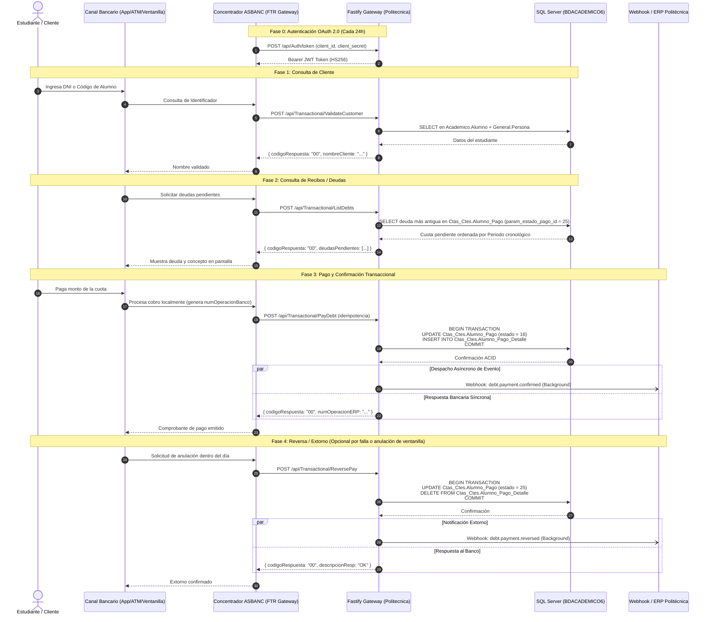

# 🔄 Flujo Operativo de Transacciones Bancarias - Politécnica ASBANC

> **Proyecto:** Politécnica ASBANC (`politecnica-asbanc`)  
> **Especificación:** ASBANC FTR / YAPAGO V46-V47 (Modalidad On-Host en Tiempo Real)  
> **SLA Bancario:** < 3.0 segundos (Certificación ASBANC) | Objetivo Interno: < 50 ms  
> **Fecha:** 2026-09-16  
> **Archivo:** `docs/flujo_operacion_transaccional.md`  

---

## 🧭 1. Visión General del Ciclo de Vida de una Transacción

En la modalidad **ON-HOST (En Línea / Tiempo Real)** de ASBANC FTR, la comunicación se realiza mediante servicios REST/JSON síncronos entre el concentrador bancario (**YAPAGO / FTR Gateway**) y la pasarela de Politécnica.

El ciclo de negocio transaccional del estudiante consta de **3 fases obligatorias** y **1 fase contingente de reversa**, precedidas por una **condición técnica previa de seguridad (Fase 0)**:

> 💡 **¿Por qué existe una "Fase 0" en el diagrama?**  
> La **Fase 0 (Autenticación OAuth 2.0)** **NO** es un proceso iniciado por el alumno ni forma parte del flujo de cobro en ventanilla/app bancaria. Se trata de un **handshake previo de infraestructura Machine-to-Machine (M2M)** exigido formalmente por la Guía ASBANC V47 (Pág. 8). El concentrador FTR solicita un token Bearer JWT una sola vez cada 24 horas (fuera de banda) y lo almacena en caché para autorizar todas las llamadas transaccionales posteriores. Sin este token válido, cualquier llamada del proceso de negocio respondería `401 Unauthorized`. Se etiqueta deliberadamente como "Fase 0" para separar la capa de seguridad/infraestructura de la secuencia de negocio del alumno (Fases 1 a 4).



---

## ⚙️ 2. Tubería de Entrada HTTP y Elementos de Código Involucrados

Cada petición entrante atraviesa de forma secuencial los siguientes módulos del código fuente:

```
[ Petición HTTP ]
       │
       ▼
1. Fastify Engine (src/server.ts) ──────────────► CORS + Helmet + Case-Insensitive URL
       │
       ▼
2. Rate Limiting (@fastify/rate-limit) ─────────► Control de abuso por IP (< 10,000 req/min)
       │
       ▼
3. Hook onRequest (audit.middleware.ts) ────────► Inyección de TraceId (UUID) + Timer hrtime
       │
       ▼
4. Auth Middleware (auth.middleware.ts) ────────► Validación Bearer JWT (jwt.util.ts) o Basic Auth
       │
       ▼
5. Esquema Zod (asbanc.schemas.ts) ─────────────► Validación estricta del contrato ASBANC V47
       │
       ▼
6. Controlador (transactional.controller.ts) ──► Lógica de Negocio + Queries Parametrizadas
       │
       ▼
7. Pool MSSQL (mssql.connection.ts) ────────────► Transacciones ACID en BDACADEMICO6
       │
       ▼
8. Hook preSerialization (audit.middleware.ts) ─► Inyección de ?metrics si fue solicitado
       │
       ▼
9. Hook onResponse (audit.middleware.ts) ────────► Métricas Prometheus + Pino Logger + INSERT AuditoriaLogs
       │
       ▼
[ Respuesta JSON ]
```

---

## 🔍 3. Desglose Paso a Paso del Flujo Transaccional

### Paso 0: Autenticación Previa (`POST /api/Auth/token`)
* **Propósito**: Conforme a la sección 3.3 (Networking, Pág. 8) de la Guía V47, el gateway bancario debe autenticarse usando credenciales de cliente (`client_id` y `client_secret`).
* **Elementos de código**:
  * Ruta: [`src/interfaces/http/routes/auth.routes.ts`](file:///home/mateo/projects/politecnica-asbanc/src/interfaces/http/routes/auth.routes.ts)
  * Esquema: `authTokenSchema` en [`src/core/schemas/asbanc.schemas.ts`](file:///home/mateo/projects/politecnica-asbanc/src/core/schemas/asbanc.schemas.ts#L61)
  * Controlador: [`AuthController.createToken`](file:///home/mateo/projects/politecnica-asbanc/src/interfaces/http/controllers/auth.controller.ts#L12)
  * Generación Criptográfica: [`generateJwtToken`](file:///home/mateo/projects/politecnica-asbanc/src/infrastructure/security/jwt.util.ts#L22) con firma nativa HMAC-SHA256.
* **Salida**: Token JWT con vigencia de 24 horas y `codigoRespuesta: "00"`.

---

### Paso 1: Validación del Estudiante (`POST /api/Transactional/ValidateCustomer`)
* **Propósito**: Validar en milisegundos si el estudiante o cliente existe en la institución y retornar su nombre oficial sanitizado para mostrarlo en la pantalla del cajero/app.
* **Elementos de código**:
  * Controlador: [`TransactionalController.validateCustomer`](file:///home/mateo/projects/politecnica-asbanc/src/interfaces/http/controllers/transactional.controller.ts#L26)
  * Middleware de Seguridad: [`asbancAuthMiddleware`](file:///home/mateo/projects/politecnica-asbanc/src/interfaces/http/middlewares/auth.middleware.ts#L17) verifica el token Bearer.
  * Validador: `validateCustomerSchema` valida `tipoConsulta` (`0`=Código, `1`=DNI, `2`=RUC) e `idConsulta`.
  * Acceso a Datos: [`getMssqlPool`](file:///home/mateo/projects/politecnica-asbanc/src/infrastructure/database/mssql.connection.ts#L48) ejecuta:
    ```sql
    SELECT TOP 1 
      alu.id AS alumno_id, alu.codigo_alumno, per.nro_documento,
      LTRIM(RTRIM(per.nombre)) + ' ' + LTRIM(RTRIM(per.apellido_paterno)) + ' ' + ISNULL(LTRIM(RTRIM(per.apellido_materno)), '') AS nombre_completo
    FROM Academico.Alumno alu
    JOIN General.Persona per ON alu.persona_id = per.id
    WHERE (@TipoConsulta = '0' AND alu.codigo_alumno = @IdConsulta)
       OR (@TipoConsulta IN ('1', '2') AND per.nro_documento = @IdConsulta);
    ```
  * Utilidad de Saneamiento: [`sanitizeAsbancString`](file:///home/mateo/projects/politecnica-asbanc/src/core/utils/asbanc.util.ts#L7) convierte a mayúsculas, remueve tildes, reemplaza `Ñ` y trunca a máximo 30 caracteres.
* **Respuestas estándar**:
  * `00` (OK): Estudiante encontrado.
  * `16` (CLIENTE NO EXISTE): Estudiante no encontrado.
  * `99` (ERROR DESCONOCIDO): Entrada mal formada o falla de conexión.

---

### Paso 2: Consulta de Recibos y Deudas (`POST /api/Transactional/ListDebts`)
* **Propósito**: Consultar qué cuota pendiente le corresponde abonar al estudiante respetando el orden de prelación financiera bancaria.
* **Elementos de código**:
  * Controlador: [`TransactionalController.listDebts`](file:///home/mateo/projects/politecnica-asbanc/src/interfaces/http/controllers/transactional.controller.ts#L126)
  * Validador: `listDebtsSchema` en [`asbanc.schemas.ts`](file:///home/mateo/projects/politecnica-asbanc/src/core/schemas/asbanc.schemas.ts#L22).
  * Regla de Negocio (Prelación Estricta):
    * Se recupera la deuda más antigua pendiente (`param_estado_pago_id = 25` / `SOL_EST_GENERADO`).
    * Criterio de ordenamiento: `p.fecha_inicio ASC` (periodo académico) $\rightarrow$ `ap.num_cuota ASC` (cuota 0=matrícula, 1..n=pensiones) $\rightarrow$ `ap.fecha_vencimiento ASC` $\rightarrow$ `ap.id ASC`.
  * Formateo de Fechas: [`formatDateAsbanc`](file:///home/mateo/projects/politecnica-asbanc/src/core/utils/asbanc.util.ts#L23) formatea fechas a `DDMMAAAA`.
* **Respuestas estándar**:
  * `00` (OK): Lista con la cuota pendiente (`numDocumento = pago_id`, `deuda`, `pagoMinimo`, `fechaVencimiento`).
  * `22` (CLIENTE SIN DEUDAS PENDIENTES): El alumno existe pero está al día en sus pagos.
  * `16` (CLIENTE NO EXISTE): Alumno no registrado.

---

### Paso 3: Confirmación y Procesamiento de Pago (`POST /api/Transactional/PayDebt`)
* **Propósito**: Asentar el pago efectuado en ventanilla bancaria garantizando atomicidad ACID, cero doble cobro (idempotencia) y emisión del número de operación ERP.
* **Elementos de código**:
  * Controlador: [`TransactionalController.payDebt`](file:///home/mateo/projects/politecnica-asbanc/src/interfaces/http/controllers/transactional.controller.ts#L308)
  * Validador: `payDebtSchema` en [`asbanc.schemas.ts`](file:///home/mateo/projects/politecnica-asbanc/src/core/schemas/asbanc.schemas.ts#L34).
  * Parseo Temporal: [`parseAsbancDate`](file:///home/mateo/projects/politecnica-asbanc/src/core/utils/asbanc.util.ts#L34) combina `fechaTxn` (`DDMMAAAA`) y `horaTxn` (`HHMMSS`) en un objeto `Date` nativo.
  * **Verificación de Idempotencia**:
    * Consulta previa en `Ctas_Ctes.Alumno_Pago`.
    * Si la cuota ya está en `param_estado_pago_id = 16`, verifica en `Ctas_Ctes.Alumno_Pago_Detalle` si coincide el `num_documento = @NumOperacionBanco`.
    * Si coincide: retorna `codigoRespuesta: '00'` con el mismo `numOperacionERP` y descripción `PAGO PREVIAMENTE REGISTRADO (IDEMPOTENTE)` sin duplicar el cobro.
  * **Transacción Atómica**:
    ```typescript
    const txn = new sql.Transaction(pool);
    await txn.begin();
    try {
      // 1. Marcar cuota como pagada
      await new sql.Request(txn).query(`
        UPDATE Ctas_Ctes.Alumno_Pago
        SET param_estado_pago_id = 16, monto_pagado_sin_mora = @ImportePagado,
            fecha_pago = @FechaPago, lugar_pago = @CanalPago, modified_by = 'ASBANC_FTR'
        WHERE id = @PagoId;
      `);
      // 2. Registrar comprobante bancario
      await new sql.Request(txn).query(`
        INSERT INTO Ctas_Ctes.Alumno_Pago_Detalle (
          alumno_pago_id, fecha_pago, lugar_pago, param_estado_pago_id,
          tipo_pago, serie, num_documento, monto, estado_auditoria, created_by, num_cuota
        ) VALUES (
          @PagoId, @FechaPago, @CanalPago, 16, 'ASBANC', 'FTR',
          @NumOperacionBanco, @ImportePagado, 1, 'ASBANC_FTR', @NumCuota
        );
      `);
      await txn.commit();
    } catch (err) {
      await txn.rollback();
      throw err;
    }
    ```
  * **Despacho de Webhook en Background**:
    * [`webhookService.dispatchPaymentWebhook`](file:///home/mateo/projects/politecnica-asbanc/src/core/services/webhook.service.ts#L26) emite asíncronamente el evento `debt.payment.confirmed` al ERP central de Politécnica sin retrasar la respuesta HTTP del banco.
  * Retorna: `{ codigoRespuesta: "00", nombreCliente: "...", numOperacionERP: "000012345", descripcionResp: "OK" }`.

---

### Paso 4: Reversa / Extorno (`POST /api/Transactional/ReversePay`)
* **Propósito**: Permitir que un cajero o sistema bancario anule un pago realizado erróneamente durante el mismo día contable.
* **Elementos de código**:
  * Controlador: [`TransactionalController.reversePay`](file:///home/mateo/projects/politecnica-asbanc/src/interfaces/http/controllers/transactional.controller.ts#L540)
  * Validador: `reversePaySchema` en [`asbanc.schemas.ts`](file:///home/mateo/projects/politecnica-asbanc/src/core/schemas/asbanc.schemas.ts#L52).
  * Transacción Atómica de Extorno:
    1. Restaura `Ctas_Ctes.Alumno_Pago` a pendiente (`param_estado_pago_id = 25`, `monto_pagado_sin_mora = 0`, `fecha_pago = NULL`).
    2. Elimina el detalle bancario en `Ctas_Ctes.Alumno_Pago_Detalle` donde `num_documento = @NumOperacionBanco`.
  * Despacha webhook de reversa: `debt.payment.reversed`.
  * Retorna: `{ codigoRespuesta: "00", descripcionResp: "OK" }`.

---

## 📊 4. Post-Procesamiento, Telemetría y Auditoría Inmutable

Cada petición (sea exitosa o con error) activa el ciclo de telemetría sin penalizar la latencia bancaria:

1. **Métricas Prometheus ([`metrics.ts`](file:///home/mateo/projects/politecnica-asbanc/src/infrastructure/telemetry/metrics.ts))**:
   * Incrementa `asbanc_txn_total{bank, endpoint, status_code}`.
   * Registra la duración en el histograma `asbanc_txn_duration_seconds`.
   * Si la duración supera 3.0s, incrementa `asbanc_sla_violations_total`.
2. **Logging Estructurado Pino ([`logger.ts`](file:///home/mateo/projects/politecnica-asbanc/src/infrastructure/telemetry/logger.ts))**:
   * Emite una línea JSON en `stdout` con `traceId`, `durationMs`, `bankCode`, `channel`, `codigoRespuesta`.
3. **Auditoría Forense Persistente ([`saveAuditLogAsync`](file:///home/mateo/projects/politecnica-asbanc/src/interfaces/http/middlewares/audit.middleware.ts#L134))**:
   * Inserta asíncronamente en `dbo.AuditoriaLogs` los payloads completos de entrada (`RequestPayload`) y salida (`ResponsePayload`), la IP de origen, el tiempo de respuesta y los números de operación.
